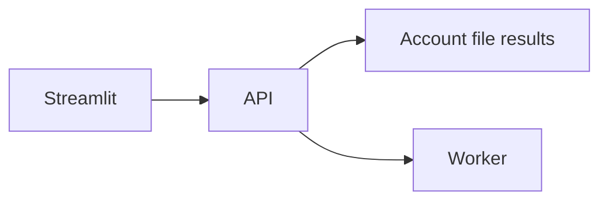
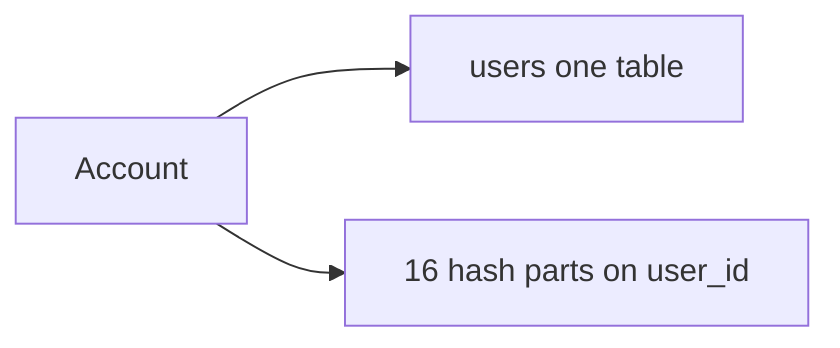

# Audio Analytics


| | |
| --- | --- |
| `docker compose up` | No cloud keys. Providers are mock |
| Azure | `LLM_PROVIDER=azure` and `SAFETY_PROVIDER=azure` |

| | |
| --- | --- |
| Sign up | Hashed password. Later calls send a token |
| Upload | 10 files, 20 MB. wav, mp3, m4a, ogg, flac |
| Filter | Date, duration, topic, Analytics |
| Insights | Length, summary, professional topics, personal topics, upcoming events |
| Analytics | Loudness, word counts, pace, sentiment |
| Summaries | All recordings, topic, day, week, month, sentiment |
| Export | Browse results: Download CSV or JSON of the rows shown, filters applied |
| Opening line | Fixed list. No model call |
| Chat reply | Azure: `gpt-5-mini` writes every reply. Fixed text only when that call fails, and in mock mode |

## Layout

```text
backend/            API, workflow, worker, schema, tests
frontend/           Streamlit
samples/            The demo WAV
docs/               Short write-ups
infra/terraform/    Azure, one module per region
docker-compose.yml  API, Streamlit, Postgres, Redis, worker, Azurite, MCP, Langfuse
```

## How it fits together



The pictures are inside [Architecture](docs/architecture.md) and [Scaling](docs/scaling.md).

[Architecture](docs/architecture.md), [data model](docs/data-model.md), [API](docs/api.md), [guardrails](docs/guardrails.md), [scaling](docs/scaling.md).

| Step | Model |
| --- | --- |
| Words | `gpt-4o-transcribe` |
| Summary, topics, chat | `gpt-5-mini` |
| Analytics | None |
| Blocked transcript | Stored. Later steps do not run |

Blob keys, container `voice`:

```text
users/{user_id}/audio/{file_id}.{ext}
users/{user_id}/transcripts/{file_id}.json
users/{user_id}/analysis/{file_id}.json
```



Schema: [backend/sql/001_schema.sql](backend/sql/001_schema.sql).

## Run locally

Docker, and about 2 GB of image space.

```bash
docker compose up --build
```

Open http://localhost:8501. The logged-out caption says mock mode is on. Create an account (password at least 8 characters). You land on Audio Analytics Agent.

Upload the bundled sample from the assistant. Processing starts on its own. Analytics sits in a small box under the result.

Pick which Analytics measures run, and their settings (loudness window, top words shown), in Analytics settings next to Summarize across files, or with `PUT /api/v1/prompts/config`. All four run by default. Changes apply to new uploads.

Show activity log starts off. Turn it on to see the live log, then the activity list below it, newest turn first. Off hides both. The choice stays through processing and reruns, and `?activity=1` or `?activity=0` in the address keeps it after a new log-in. The side panel stays put while the chat scrolls. The chat input stays pinned to the bottom. The opening screen offers two replies: Summarize my calls and Upload a recording.

| Service | Port | Role |
| --- | --- | --- |
| web | 8501 | Streamlit |
| api | 8000 | FastAPI. This machine publishes 8001 |
| postgres | 5432 | Database `voice`, and `langfuse` for traces. User `voice` |
| redis | 6379 | 0 is the job queue. 2 is the rate limit and Langfuse |
| worker | | Celery, including the schedule |
| azurite | 10000 | Local blob store, container `voice` |
| azurite-mcp | 8090 | `fetch_audio` for the transcription step |
| langfuse-web | 3000 | Traces, when both keys are set. Names are in [Glossary](docs/glossary.md) |

A local override also starts Redis Insight (5540), Azurite UI (8080), Flower (5555), pgAdmin (5050), and Dozzle (9999). That file is not in git.


Cloud leaves `MCP_AUDIO_URL` empty.

| Sample | |
| --- | --- |
| File | `samples/sample_call.wav` |
| That name | Fixed script |
| Other files | Stand-in from the file hash |
| Regenerate | `python3 scripts/generate_sample_audio.py` |

### Tests

```bash
python3 -m pip install -r backend/requirements.txt -r backend/requirements-dev.txt
ruff check backend frontend
cd backend && pytest
```

Local tests need Python 3.12, the same version CI and the api image use, and `ffmpeg` on the PATH for the mp3 tests. They do not need Docker. The partition check runs when `POSTGRES_TEST_URL` is set. CI sets it.

To run the same tests inside the api image (it has no pytest or ruff, so the dev requirements are installed into the throwaway container first):

```bash
docker compose run --rm --no-deps -T -v "$PWD:/repo" -w /repo/backend api \
  sh -c 'pip install -q --user -r requirements-dev.txt && python -m pytest'
```

## Azure

This is a design plus Terraform. It is not a running multi-region deployment.

```bash
cd infra/terraform
cp terraform.tfvars.example terraform.tfvars   # set db_admin_password and jwt_secret
terraform init
terraform plan
```

`regions` defaults to eastus and westeurope. Each region is its own stack. Front Door is the shared front door. Check without credentials:

```bash
terraform fmt -check -recursive
terraform init -backend=false
terraform validate
```

Notes: [infra/terraform/README.md](infra/terraform/README.md). The release picture and the planning numbers are in [Scaling](docs/scaling.md).

Production settings:

```text
LLM_PROVIDER=azure
SAFETY_PROVIDER=azure
BLOB_PROVIDER=azure
BROKER=servicebus
ANALYSIS_MODE=celery
```

| Process | Command |
| --- | --- |
| Worker | `python -m app.jobs.service_bus_worker` |
| Every 15 minutes | `python -m app.jobs.run_scheduled_rollup` |
| On demand | The API. Same `summarize_group` |

## Configuration

Copy [.env.example](.env.example) to `.env`. Mock mode needs no keys. The comments in that file cover the rest. The ones people trip on:

| Variable | Meaning |
| --- | --- |
| `LLM_PROVIDER` / `SAFETY_PROVIDER` | `mock` or `azure` |
| `AZURE_OPENAI_CHAT_TEMPERATURE` | Leave empty. `gpt-5-mini` rejects 0 |
| `MCP_AUDIO_URL` | Set in Compose. Empty uses the bytes already loaded |
| `ANALYSIS_MODE` | `celery` in Compose, `inline` in tests |
| `BROKER` | `celery` or `servicebus` |
| `MOCK_STAGE_DELAY_SEC` | `1.5` in Compose so the stages are visible. `0` elsewhere |
| `CHUNK_CHARS` / `MAX_CHUNKS` | 4000 / 20. Longer transcripts are split, then merged |
| `RATE_LIMIT_REQUESTS` | 120 per minute per account |

## API

Base path `/api/v1`. Authenticated routes send `Authorization: Bearer <token>`. Request notes: [docs/api.md](docs/api.md).

| Method | Path | Auth | Purpose |
| --- | --- | --- | --- |
| POST | `/auth/signup` | no | Create an account |
| POST | `/auth/login` | no | Return a token |
| GET | `/auth/me` | yes | This account |
| POST | `/files` | yes | Upload, up to 10 |
| GET | `/files` | yes | List, with filters |
| GET | `/files/{id}` | yes | One recording, plus the transcript |
| GET | `/files/{id}/audio` | yes | Audio bytes |
| GET | `/events` | yes | Processing log |
| POST | `/files/{id}/analyze` | yes | Run it again |
| DELETE | `/files/{id}` | yes | Delete it |
| GET | `/prompts/options` | no | Analytics catalog |
| GET | `/prompts/config` | yes | The saved options |
| PUT | `/prompts/config` | yes | Save the chosen options |
| POST | `/summaries` | yes | Group completed summaries |
| GET | `/summaries` | yes | Recent summaries |
| POST | `/chat` | yes | One question |
| GET | `/health` | no | Liveness |
| GET | `/meta` | no | Which providers are on |

## Guardrails

[docs/guardrails.md](docs/guardrails.md).

**Layer 2 design choice.** RMS loudness, noun and adjective counts, speaking pace, and sentiment are deterministic, so they are computed in code (RMS math, spaCy, a fixed word list), not by an LLM. That is more accurate, free, and repeatable, and the user's choices never reach any LLM, so they cannot carry a prompt injection. Choices are checked against a fixed whitelist with typed parameters. Users select and configure them in the Analytics settings panel (the brief: "Users can select and configure the predefined prompt on the UI").

**Audio guardrails.** Every transcript goes through a content-safety check (Azure AI Content Safety Prompt Shields; a fixed phrase list in local mock mode) that blocks before any LLM call. Behind it, the system prompts name common injection patterns and say never to obey them, and transcripts, summaries, and tool results are fenced in fixed tags as untrusted data.

## Worth knowing

| | |
| --- | --- |
| Screen | Streamlit, including a phone. No separate mobile app |
| Loudness | WAV is read directly. mp3, m4a, ogg, and flac are decoded with ffmpeg first, so duration and RMS work for every upload type |
| Sample pace | The file is a short tone and the words are a fixed script |
| Chat history | Postgres, per account and chat. The agent sees the last eight turns |
| Schema change | A SQL script at startup |
| Account rows | One region. No automatic move |
| Cost | [docs/scaling.md](docs/scaling.md) |

## Demo

Record http://localhost:8501 in mock mode. Sign up, upload the bundled sample, and show Transcription, Insights, and Analytics. The last minute is the cloud picture in [Scaling](docs/scaling.md).
