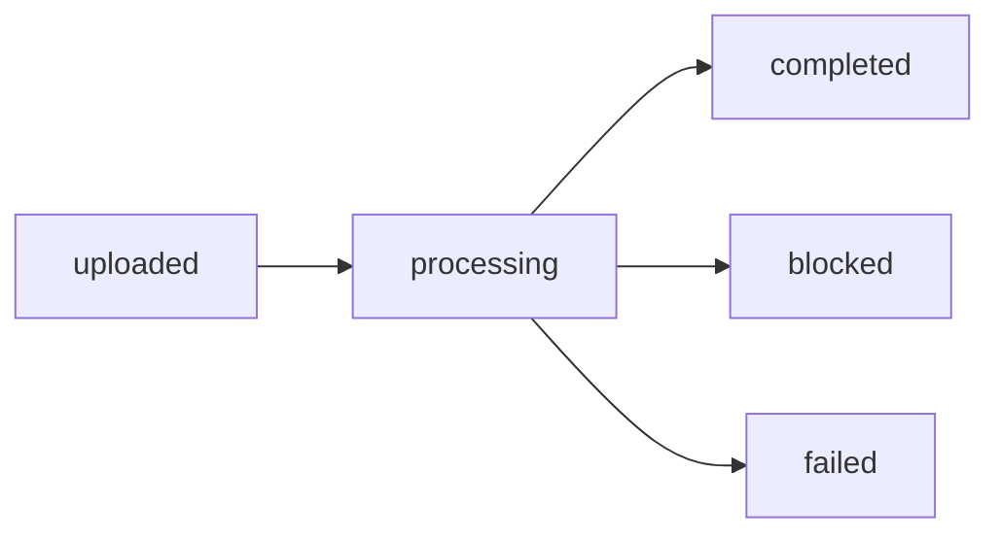

# API

API means application programming interface.

`http://localhost:8000` under `/api/v1`. The one exception is `GET /`, which sits at the root.

## Names

| Short form | Meaning |
| --- | --- |
| HTTP | Hypertext Transfer Protocol |
| JSON | JavaScript Object Notation |
| URL | Uniform Resource Locator |
| MB | megabyte |
| ID | identifier |
| Bearer | sign-in token on `Authorization` |
| 201 | created |
| 401 | wrong email or password, or a missing, invalid, or expired token |
| 400 | the request was rejected |
| 404 | missing, including another account's file |
| 409 | that email already exists |
| 429 | over 120 calls in one minute |
| GET, POST, PUT, DELETE | the HTTP methods listed on each route |

Authenticated routes send `Authorization: Bearer <token>`. Errors look like `{"detail": "..."}`.

Passwords are stored only as bcrypt hashes. Sign-up and log-in return a JWT signed with `JWT_SECRET` (HS256); its subject (`sub`) is the account id and it expires after `JWT_EXPIRE_MINUTES` (1440). Every route takes the account from the token, so another account's ids answer 404.

## Request bodies

| Route | Body | Answer |
| --- | --- | --- |
| `POST /auth/signup` | JSON `{"email": "...", "password": "..."}` | 201 `{"access_token", "token_type": "bearer", "user_id", "email"}` |
| `POST /auth/login` | JSON `{"email": "...", "password": "..."}` | 200, same shape as sign-up |
| `POST /files` | multipart, one `files` part per file (up to 10) | 201 `{"items": [{"id", "status": "uploaded", "stage": "queued", ...}]}` |
| `GET /files/{id}` | none | 200 the recording: `status`, `stage`, `summary`, `taxonomy`, `layer2`, `transcript` |
| `POST /chat` | JSON `{"message": "...", "history": [], "session_id": null}`; only `message` is required, extra fields are 422 | 200 `{"reply", "tool_calls", "session_id"}` |

```bash
API=http://localhost:8000/api/v1
curl -s -X POST $API/auth/signup -H 'Content-Type: application/json' \
  -d '{"email":"alice@example.com","password":"alicepass123"}'
TOKEN=$(curl -s -X POST $API/auth/login -H 'Content-Type: application/json' \
  -d '{"email":"alice@example.com","password":"alicepass123"}' \
  | python3 -c 'import json,sys; print(json.load(sys.stdin)["access_token"])')
FILE_ID=$(curl -s -X POST $API/files -H "Authorization: Bearer $TOKEN" \
  -F files=@samples/sample_call.wav \
  | python3 -c 'import json,sys; print(json.load(sys.stdin)["items"][0]["id"])')
curl -s "$API/files/$FILE_ID" -H "Authorization: Bearer $TOKEN"     # repeat until "status": "completed"
curl -s -X POST $API/chat -H "Authorization: Bearer $TOKEN" -H 'Content-Type: application/json' \
  -d '{"message":"What action items came out of my recordings?"}'
```

## Routes

| Method | Path | Auth | What it does |
| --- | --- | --- | --- |
| POST | `/auth/signup` | no | Create an account and return a token |
| POST | `/auth/login` | no | Return a token |
| GET | `/auth/me` | yes | This account |
| POST | `/files` | yes | Upload. Field name `files`, up to 10 |
| GET | `/files` | yes | List this account's recordings |
| GET | `/files/{id}` | yes | One recording, plus the transcript |
| GET | `/files/{id}/audio` | yes | The audio bytes |
| POST | `/files/{id}/analyze` | yes | Run it again |
| DELETE | `/files/{id}` | yes | Delete the file and its rows |
| GET | `/events` | yes | This account's processing log, newest first |
| GET | `/prompts/options` | no | The Analytics catalog |
| GET | `/prompts/config` | yes | What this account turned on |
| PUT | `/prompts/config` | yes | Replace that list |
| POST | `/summaries` | yes | Group the completed summaries |
| GET | `/summaries` | yes | The latest summaries, up to 50 |
| POST | `/reports` | yes | Start the All groupings report. Returns 202 and the report row |
| GET | `/reports` | yes | The latest reports, up to 20 |
| GET | `/reports/{id}` | yes | One report: `queued`, `running`, `completed`, or `failed` |
| POST | `/chat` | yes | One question. Saves the turn on this account |
| GET | `/chat/session` | yes | The latest chat and its saved turns |
| POST | `/chat/session` | yes | Start an empty chat |
| GET | `/health` | no | Liveness |
| GET | `/health/ready` | no | Database check |
| GET | `/meta` | no | Which providers are on |
| GET | `http://localhost:8000/` (outside `/api/v1`) | no | Service name |

The order of work after an upload.


How the recording status ends.



| | |
| --- | --- |
| Password | at least 8 characters, at most 72 bytes |
| Upload | field `files`, up to 10, 20 MB, `wav` `mp3` `m4a` `ogg` `flac` |
| Chat `message` | 1 to 2,000 characters |
| Chat `history` | at most 8, role `user` or `assistant` |
| Chat tools | `search_files` `get_analysis` `run_summary` `profile_speaker` |
| Empty Analytics list | All seven options run at their defaults |

## List filters

| Filter | |
| --- | --- |
| `date_from` `date_to` | Optional |
| `min_duration` `max_duration` | Optional |
| `taxonomy` | Optional |
| `custom` | `name:value` |
| `limit` | Default 50 |
| `offset` | Optional |

## Summaries `group_by`

| `group_by` | |
| --- | --- |
| `user` | All of this account's completed recordings |
| `taxonomy_label` | Topic |
| `day` `week` `month` | Calendar bucket |
| `sentiment` | Sentiment |

## All groupings report

Body: optional `groupings` (any of `day` `week` `month` `user` `taxonomy_label` `sentiment` `tone` `pace_band` `key_entity` `action_items`; all when left out), optional `time_from` and `time_to`. Unknown groupings are 400 and extra fields are 422.

Files are grouped in code so groups are exact; the AI writes the summary for every group. Each group carries `key`, `file_count`, `total_duration_sec`, `avg_duration_sec`, `avg_words_per_minute`, `avg_rms_mean`, `sentiment_mix`, `tone_mix`, `action_item_count`, and `summary`. Only completed recordings are read; `blocked_skipped` counts the blocked ones.

| Brief asks for | Where it is |
| --- | --- |
| Time range: day, week, month | `day` `week` `month` groupings |
| Context summary | An AI summary for every group, from the fixed hardened rollup prompt (`gpt-5-mini`; mock in local mode and tests) over the files' Insights summaries |
| User: all files together | `user` grouping, one group named `all files` |
| Taxonomy label | `taxonomy_label`, one group per topic, personal topic, or upcoming event |
| Other Layer 2 groupings | `sentiment`, `tone`, `pace_band` (slow under 110 wpm, conversational 110 to 170, brisk over 170), `key_entity`, `action_items` |
