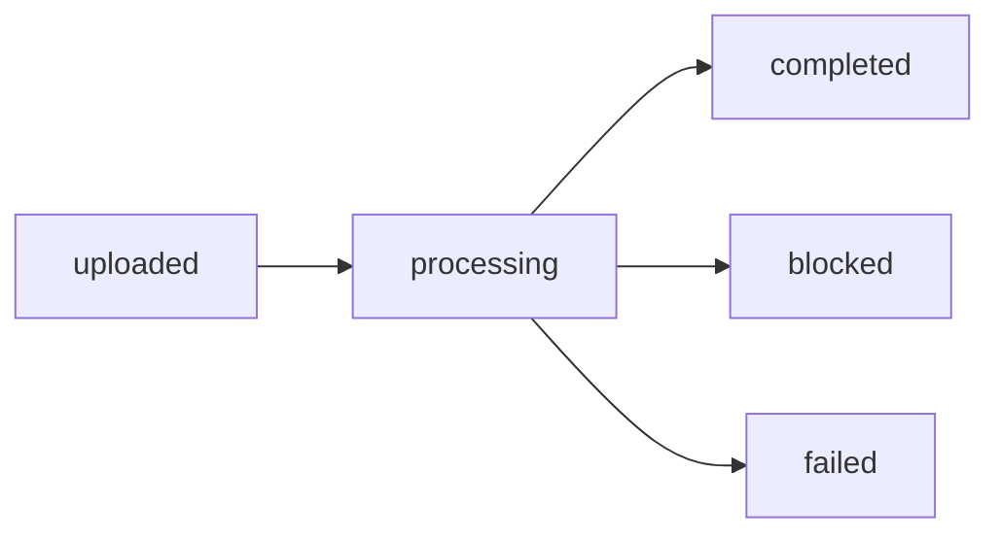

# API

API means application programming interface.

`http://localhost:8000` under `/api/v1`. This machine uses port 8001.

## Names

| Short form | Meaning |
| --- | --- |
| HTTP | Hypertext Transfer Protocol |
| JSON | JavaScript Object Notation |
| URL | Uniform Resource Locator |
| MB | megabyte |
| ID | identifier |
| Bearer | sign-in token on `Authorization` |
| 201 | created |
| 401 | the password did not match |
| 400 | the request was rejected |
| 404 | missing, including another account's file |
| 409 | that email already exists |
| 429 | over 120 calls in one minute |
| GET, POST, PUT, DELETE | the HTTP methods listed on each route |

Authenticated routes send `Authorization: Bearer <token>`. Errors look like `{"detail": "..."}`.

## Routes

| Method | Path | Auth | What it does |
| --- | --- | --- | --- |
| POST | `/auth/signup` | no | Create an account and return a token |
| POST | `/auth/login` | no | Return a token |
| GET | `/auth/me` | yes | This account |
| POST | `/files` | yes | Upload. Field name `files`, up to 10 |
| GET | `/files` | yes | List this account's recordings |
| GET | `/files/{id}` | yes | One recording, plus the transcript |
| GET | `/files/{id}/audio` | yes | The audio bytes |
| POST | `/files/{id}/analyze` | yes | Run it again |
| DELETE | `/files/{id}` | yes | Delete the file and its rows |
| GET | `/events` | yes | This account's processing log, newest first |
| GET | `/prompts/options` | no | The Analytics catalog |
| GET | `/prompts/config` | yes | What this account turned on |
| PUT | `/prompts/config` | yes | Replace that list |
| POST | `/summaries` | yes | Group the completed summaries |
| GET | `/summaries` | yes | The latest summaries, up to 50 |
| POST | `/chat` | yes | One question. Saves the turn on this account |
| GET | `/chat/session` | yes | The latest chat and its saved turns |
| POST | `/chat/session` | yes | Start an empty chat |
| GET | `/health` | no | Liveness |
| GET | `/health/ready` | no | Database check |
| GET | `/meta` | no | Which providers are on |
| GET | `/` | no | Service name |

The order of work after an upload.

How the recording status ends.

| | |
| --- | --- |
| Password | 8 to 72 bytes |
| Upload | field `files`, up to 10, 20 MB, `wav` `mp3` `m4a` `ogg` `flac` |
| Chat `message` | 1 to 2,000 characters |
| Chat `history` | at most 8, role `user` or `assistant` |
| Chat tools | `search_files` `get_analysis` `run_summary` `profile_speaker` |
| Empty Analytics list | Insights still runs |

## List filters

| Filter | |
| --- | --- |
| `date_from` `date_to` | Optional |
| `min_duration` `max_duration` | Optional |
| `taxonomy` | Optional |
| `custom` | `name:value` |
| `limit` | Default 50 |
| `offset` | Optional |

## Summaries `group_by`

| `group_by` | |
| --- | --- |
| `user` | All of this account's completed recordings |
| `taxonomy_label` | Topic |
| `day` `week` `month` | Calendar bucket |
| `sentiment` | Sentiment |
