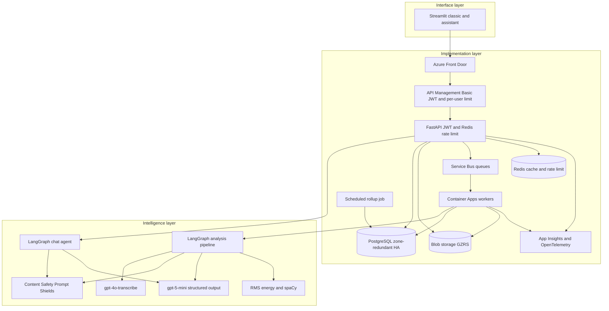
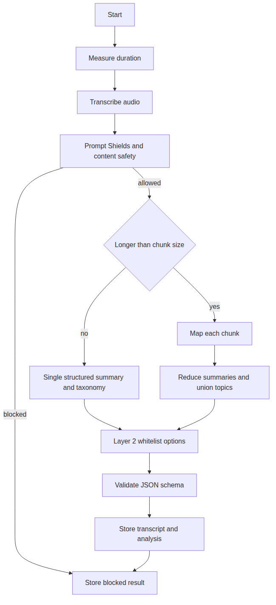
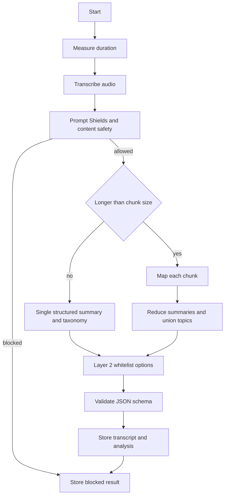

# Architecture

Voice Analytics has three layers. The interface is a narrow Streamlit client. The implementation layer stores data, authenticates users, and runs background work. The intelligence layer turns audio into a transcript, a summary, a taxonomy, and optional Layer 2 features.

## Layers

Source: [diagrams/system-architecture.mmd](diagrams/system-architecture.mmd). SVG: [diagrams/system-architecture.svg](diagrams/system-architecture.svg).

The browser talks only to Streamlit. Streamlit calls FastAPI with the bearer token. That keeps auth and file bytes on the server side of the UI.

Classic mode is the library, upload, prompt, rollup, and account pages. Assistant mode is a chat on the same client. The sidebar switches between them. Upload, prompt configuration, and file status in the chat use the existing HTTP APIs. Follow-up questions use `POST /api/v1/chat`.

Assistant keeps a flowchart of the selected file's `stage` (`upload`, `queued`, `transcribe`, `safety`, `layer1`, `layer2`, `saved`). The worker writes that column as each node starts, and `GET /api/v1/files` is what the page polls. A second read, `GET /api/v1/events`, is the live log: blob save, Postgres insert, queue, worker pickup, stage start and finish with duration, save, and errors. The log is limited to the JWT user. `MOCK_STAGE_DELAY_SEC` (1.5 in Compose, 0 in tests) pauses on each step so those updates are visible.

## Request path in Azure

Front Door is the public entry. Each origin is a regional API Management gateway, not the Container App. API Management checks `X-Azure-FDID` against the Front Door profile id, validates the HS256 JWT on authenticated routes, and applies `rate-limit-by-key` with the token's `sub` claim. A limit breach returns 429. Public routes (health, meta, sign-up, login, and the Layer 2 catalog) skip JWT validation and are limited per source IP.

The Container App ingress allowlists API Management's public IP addresses, so the app hostname does not accept traffic from the rest of the internet. API Management Basic cannot be placed in a virtual network, and Front Door Standard cannot private-link to that gateway. The IP allowlist plus the Front Door header is the lock this tier can actually enforce. Private Link would mean API Management Premium and Front Door Premium.

The API applies the same per-user limit again in Redis. That counter is what Compose uses, and it still applies in Azure if a request reaches the app.

## Chat agent

The chat route builds a LangGraph with three nodes: plan, tools, and compose. The tool set is fixed:

| Tool | What it does |
| --- | --- |
| `search_files` | The caller's files, filtered by date, duration, or taxonomy text |
| `get_analysis` | One file's summary, taxonomy, and Layer 2 results |
| `run_summary` | The same on-demand rollup as `POST /api/v1/summaries` |

`user_id` comes from the JWT. It is not a tool argument. A file id that belongs to someone else is `not_found`. The tools do not return the raw transcript. Summaries and taxonomy are the data the reply is allowed to use.

When `LLM_PROVIDER=mock`, the plan node matches the question to one tool with fixed rules, the tools node runs it, and the compose node writes a deterministic reply from the tool result. When `LLM_PROVIDER=azure`, the plan node asks `gpt-5-mini` for one tool call and the compose node asks for a JSON object `{"reply": "..."}`, which Pydantic checks. A schema failure falls back to the same rule-based reply. One tool runs per question.

Streamlit keeps the transcript of the chat in session state and sends at most the last eight turns. The server does not store that history.

## Analysis pipeline

LangGraph is the orchestrator. Duration is measured from the WAV header and samples, not guessed by the model. Transcription uses `gpt-4o-transcribe` when `LLM_PROVIDER=azure`, or a deterministic stand-in when `LLM_PROVIDER=mock`. Content Safety runs before any summary call. If the transcript is blocked, the model is not called.

Speech-to-text uses `gpt-4o-transcribe`. Analysis and the chat agent use `gpt-5-mini`. Both deployments are on one Azure OpenAI resource. Requests to the chat deployment omit `temperature` unless `AZURE_OPENAI_CHAT_TEMPERATURE` is set, because this model rejects an explicit temperature of 0. JSON replies still use `response_format`.

Summaries use one structured call when the transcript fits in `CHUNK_CHARS` (default 4000). Longer transcripts are map-reduced: each chunk returns a partial summary and topic lists, then a reduce call merges them. Topic lists are unioned so a later chunk cannot be dropped. `gpt-5-mini` is asked for JSON that matches a strict JSON schema. The API checks that payload again with Pydantic before it is stored.

Layer 2 runs only the options stored on the user. Those options come from a server-side catalog. RMS and speaking pace are computed in-process. Nouns and adjectives come from spaCy `en_core_web_sm`. Sentiment uses a fixed lexicon. None of these steps accept a free-form system prompt.

## Local and production brokers

| Concern | Local `docker compose` | Production Terraform |
| --- | --- | --- |
| API | Uvicorn container | Container App, min 2, max 8 |
| Queue | Redis + Celery, worker started with beat | Service Bus queues and a Container App worker |
| Schedule | Celery beat inside the worker | Container Apps Job, cron `*/15 * * * *` |
| Objects | Azurite | Azure Blob, GZRS, private container |
| Database | Postgres 16 | Flexible Server 16, zone-redundant HA, geo-redundant backups, hash partitions |
| Models | Mock providers, no keys | Azure OpenAI and Content Safety |
| Edge | none | Front Door to API Management Basic, then the Container App |
| Rate limit | Redis in Compose | API Management per `sub`, and Redis again in the API |
| Traces | OpenTelemetry off unless configured | OpenTelemetry on; Langfuse when keys exist |

`ANALYSIS_MODE=inline` runs the pipeline in the API process. Tests use that mode. Compose uses `celery`. Production sets `BROKER=servicebus`, and the API publishes `{kind, file_id, user_id}` to the `transcription` queue. The worker process `python -m app.jobs.service_bus_worker` consumes `transcription`, `llm-layer1`, `llm-layer2`, and `rollup`.

The four queues are real infrastructure. Today a message on any analysis queue runs the full pipeline, which is idempotent. Splitting transcription and LLM into separate consumers is a scale step, not a schema change. See [scaling.md](scaling.md).

## Observability

OpenTelemetry is initialized when `OTEL_ENABLED=true`. If `OTEL_EXPORTER_OTLP_ENDPOINT` is set, spans go to that OTLP HTTP endpoint. FastAPI is instrumented, and each pipeline node opens a span.

Langfuse receives a generation observation for map, reduce, single-shot, and rollup calls when both `LANGFUSE_PUBLIC_KEY` and `LANGFUSE_SECRET_KEY` are set. Missing keys disable it. A Langfuse export error is logged and does not fail the analysis.

Terraform also creates Log Analytics and Application Insights per region. Point the OTLP endpoint at a collector that forwards to Azure Monitor if you want one trace pipeline for API spans and model spans.
