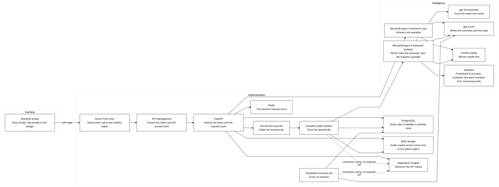
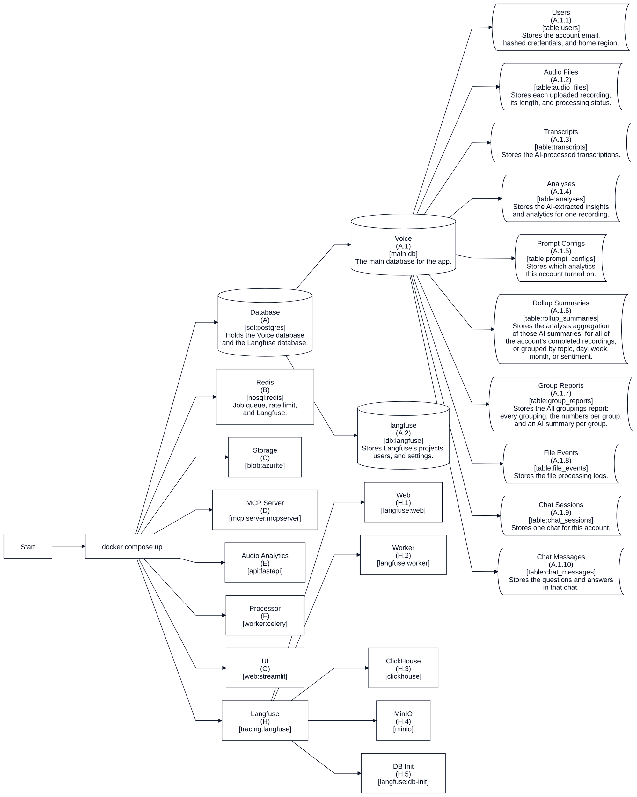
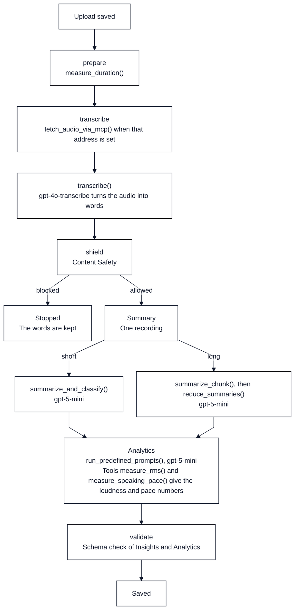
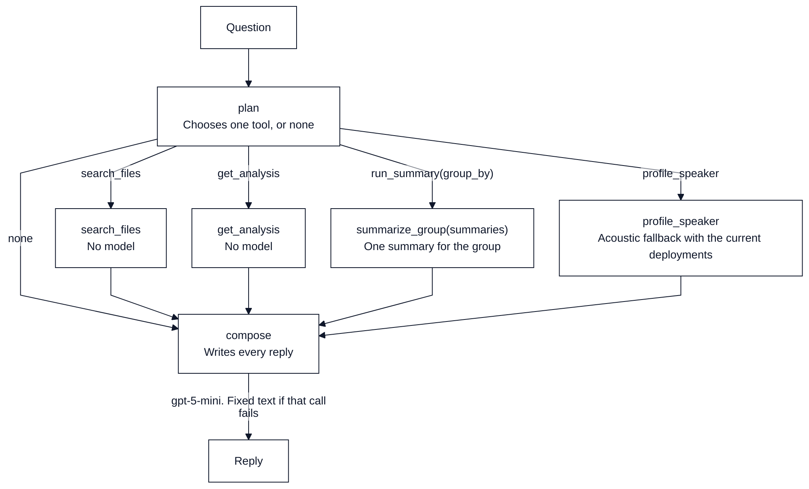

# Architecture

## Names

| Short form | Meaning |
| --- | --- |
| API | application programming interface |
| HTTP | Hypertext Transfer Protocol |
| JSON | JavaScript Object Notation |
| JWT | JSON Web Token |
| IP | Internet Protocol address |
| URL | Uniform Resource Locator |
| UI | user interface |
| SQL | Structured Query Language |
| NoSQL | a store that is not queried with Structured Query Language |
| DB | database |
| MCP | Model Context Protocol |

## System

This is the multi-region Azure design, kept in the repo with its Terraform. It is not a running deployment; the prototype runs on one machine with `docker compose up` (see [This machine](#this-machine)). In the design, a signed-in request enters through Front Door. The API answers a question, queues an upload, or writes the grouped summaries. Only the API sits behind Front Door. The Streamlit screen runs on the local machine and is not part of the Terraform. The API, the workers, and the summary job get the Application Insights connection string. The API sends its traces there. The worker and job entry points do not start the exporter yet. Front Door does not route by `home_region`, so a call can land in a region that has no row for the account, and that region answers 401.

## This machine

What `docker compose up` starts.

## One recording (MAF analysis workflow)

One saved file is measured, transcribed, checked, summarized, then run through the ticked Analytics prompts on gpt-5-mini. Loudness and pace numbers come from measuring tools.

## One question (MAF chat workflow)

| | Azure | Mock |
| --- | --- | --- |
| Plan | Fixed rules first for memory, greetings, capabilities, voice questions, a named file id, and "what it says". Otherwise `gpt-5-mini` picks the tool. Rules again if that call fails or leaves a clear summary request without a tool | Fixed rules |
| Reply | `gpt-5-mini` writes every reply, including greetings, help, and tool errors. Fixed text only when that call fails | Fixed rules |
| Voice questions | Gender, age, accent, emotion, or who is speaking call `profile_speaker` on the recording named in the question, otherwise the newest. The audio comes through the MCP `fetch_audio` tool (a direct blob read when `MCP_AUDIO_URL` is unset or the call fails) | Same |
| Voice traits | Need an audio-input deployment. `gpt-5-mini` takes text and images, and `gpt-4o-transcribe` only transcribes, so with the current deployments the acoustic fallback answers: duration and loudness only. Known limit: for an `.mp3` upload, `azure.py` labels the audio `mp3` from the filename even after ffmpeg has turned it into WAV | Acoustic fallback |
| Temperature | Empty unless `AZURE_OPENAI_CHAT_TEMPERATURE` is set | |

The steps that answer one question.

## Call path

Which file calls the next.

```mermaid
%%{init: {"theme": "base", "htmlLabels": true, "securityLevel": "antiscript", "themeVariables": {"fontFamily": "monospace", "fontSize": "15px", "primaryColor": "#ffffff", "primaryTextColor": "#0f172a", "primaryBorderColor": "#0f172a", "lineColor": "#0f172a", "background": "#ffffff"}, "flowchart": {"htmlLabels": true, "curve": "linear", "padding": 18, "nodeSpacing": 28, "rankSpacing": 72, "wrappingWidth": 480, "useMaxWidth": false}}}%%
flowchart LR
  streamlit["<span style='font-weight:normal'>streamlit_app.py</span><br><span style='font-size:11px;color:rgb(148,163,184)'>frontend/streamlit_app.py</span><br><i><span style='font-size:11px;color:rgb(148,163,184);font-family:Courier'>Signs in, then opens the assistant.</span></i>"] -->|"render_assistant()"| assistant["<span style='font-weight:normal'>assistant_ui.py</span> | <b>render_assistant()</b><br><span style='font-size:11px;color:rgb(148,163,184)'>frontend/assistant_ui.py</span><br><i><span style='font-size:11px;color:rgb(148,163,184);font-family:Courier'>Sends what you picked.</span></i>"]
  assistant --> client["<span style='font-weight:normal'>api_client.py</span> | <b>upload()</b>, <b>chat()</b><br><span style='font-size:11px;color:rgb(148,163,184)'>frontend/api_client.py</span><br><i><span style='font-size:11px;color:rgb(148,163,184);font-family:Courier'>Sends the request.</span></i>"]
  client -->|"upload()"| files["<span style='font-weight:normal'>files.py</span> | <b>upload_files()</b><br><span style='font-size:11px;color:rgb(148,163,184)'>backend/app/api/routes/files.py</span><br><i><span style='font-size:11px;color:rgb(148,163,184);font-family:Courier'>Saves the recording.</span></i>"]
  client -->|"chat()"| chat
  files -->|"enqueue_analysis()"| service["<span style='font-weight:normal'>analysis/service.py</span> | <b>enqueue_analysis()</b>, <b>run_file_analysis()</b><br><span style='font-size:11px;color:rgb(148,163,184)'>backend/app/analysis/service.py</span><br><i><span style='font-size:11px;color:rgb(148,163,184);font-family:Courier'>Queues the job, then runs the analysis.</span></i>"]
  service -->|"analyze_file_task.apply_async()"| tasks
  service --> graphPy["<span style='font-weight:normal'>analysis/graph.py</span> | <b>run_graph()</b><br><span style='font-size:11px;color:rgb(148,163,184)'>backend/app/analysis/graph.py</span><br><i><span style='font-size:11px;color:rgb(148,163,184);font-family:Courier'>Microsoft Agent Framework works through one recording.<br>First the words, then the summary, then the Analytics prompts.</span></i>"]
  tasks["<span style='font-weight:normal'>jobs/tasks.py</span> | <b>analyze_file_task()</b><br><span style='font-size:11px;color:rgb(148,163,184)'>backend/app/jobs/tasks.py</span><br><i><span style='font-size:11px;color:rgb(148,163,184);font-family:Courier'>Runs the queued job.</span></i>"] --> service
  chat["<span style='font-weight:normal'>chat.py</span> | <b>chat()</b><br><span style='font-size:11px;color:rgb(148,163,184)'>backend/app/api/routes/chat.py</span><br><i><span style='font-size:11px;color:rgb(148,163,184);font-family:Courier'>Answers the question.</span></i>"] --> agent["<span style='font-weight:normal'>chat/agent.py</span> | <b>run_chat_agent()</b>, <b>execute_tool()</b><br><span style='font-size:11px;color:rgb(148,163,184)'>backend/app/chat/agent.py</span><br><i><span style='font-size:11px;color:rgb(148,163,184);font-family:Courier'>Microsoft Agent Framework answers one question<br>about this account's recordings.</span></i>"]
  agent --> tools["<span style='font-weight:normal'>chat/tools.py</span> | <b>run_summary(group_by)</b><br><span style='font-size:11px;color:rgb(148,163,184)'>backend/app/chat/tools.py</span><br><i><span style='font-size:11px;color:rgb(148,163,184);font-family:Courier'>Asks for a summary.</span></i>"]
  tools --> summary["<span style='font-weight:normal'>summarize_group.py</span> | <b>summarize_group(summaries)</b><br><span style='font-size:11px;color:rgb(148,163,184)'>backend/app/analysis/summarize_group.py</span><br><i><span style='font-size:11px;color:rgb(148,163,184);font-family:Courier'>Writes one summary for the group.</span></i>"]
  graphPy --> mcp["<span style='font-weight:normal'>mcp_audio.py</span> | <b>fetch_audio_via_mcp()</b><br><span style='font-size:11px;color:rgb(148,163,184)'>backend/app/analysis/mcp_audio.py</span><br><i><span style='font-size:11px;color:rgb(148,163,184);font-family:Courier'>Reads the audio.</span></i>"]
  graphPy --> intelligence["<span style='font-weight:normal'>intelligence.py</span> | <b>get_intelligence()</b><br><span style='font-size:11px;color:rgb(148,163,184)'>backend/app/analysis/providers/intelligence.py</span><br><i><span style='font-size:11px;color:rgb(148,163,184);font-family:Courier'>Azure OpenAI, or the mock provider.<br>Transcribes the audio and writes the insights.</span></i>"]
  graphPy --> layer2["<span style='display:inline-block;width:19ch;text-align:right;font-weight:400'>llm_options.py</span> | <b>run_predefined_prompts()</b><br><span style='display:inline-block;width:19ch;text-align:right;font-weight:400'></span> | gpt-5-mini<br><span style='display:inline-block;width:19ch;text-align:right;font-weight:400'>SignalTools</span> | <b>measure_rms()</b><br><span style='display:inline-block;width:19ch;text-align:right;font-weight:400'></span> | <b>measure_speaking_pace()</b><br><span style='font-size:11px;color:rgb(148,163,184)'>backend/app/analysis/llm_options.py</span><br><i><span style='font-size:11px;color:rgb(148,163,184);font-family:Courier'>Analytics.<br>Predefined AI prompts; loudness and pace numbers<br>come from measuring tools.</span></i>"]
```

## Local and cloud

| | Local | Cloud |
| --- | --- | --- |
| Interface | Streamlit (`web`, port 8501) | Not in the Terraform design. No frontend host |
| API | FastAPI on Uvicorn (`api`, port 8000) | Container App `ca-api`, 2 copies growing to 8 |
| Queue | Redis and Celery | Service Bus |
| Schedule | Celery beat | Every 15 minutes |
| Files | Azurite, then `fetch_audio` when `MCP_AUDIO_URL` is set | Blob. The bytes are already loaded |
| Database | PostgreSQL 16 | One server per region, plus a standby in another zone |
| Models | Azure OpenAI and Content Safety when `LLM_PROVIDER` and `SAFETY_PROVIDER` are `azure`. Mock by default (Compose and `.env.example`), with no keys | Azure OpenAI and Content Safety |
| Front door | none locally | Front Door, then API Management. Any healthy region. No routing by `home_region`; the other region answers 401 |
| Work | Inline in tests. Celery in Compose | 1 to 20 worker copies. A Service Bus rule adds one copy per waiting `transcription` message |
| Account limit | 120 a minute when the limiter is on | 120 a minute |
| Trace | Langfuse when both keys are set. A failed send leaves the file result in place | Not configured. Terraform sets no Langfuse keys |
| Telemetry | Application Insights only when `APPLICATIONINSIGHTS_CONNECTION_STRING` is set (the worker in Compose) | API, workers, and job get the connection string. Only the API starts the exporter |

[Scaling](scaling.md)
