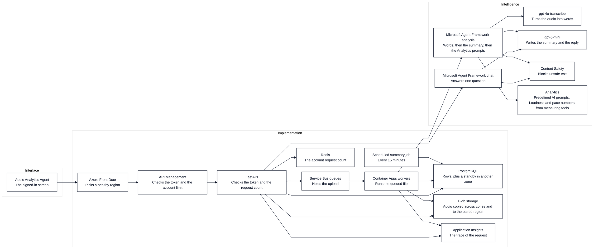
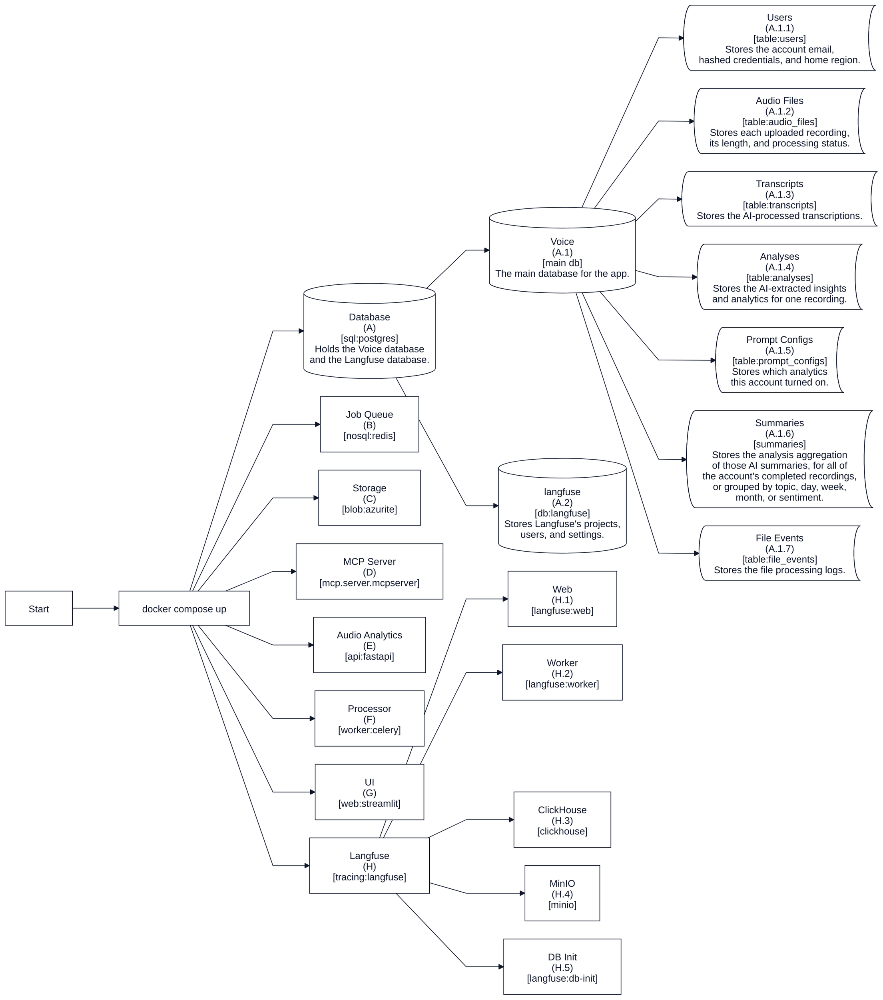
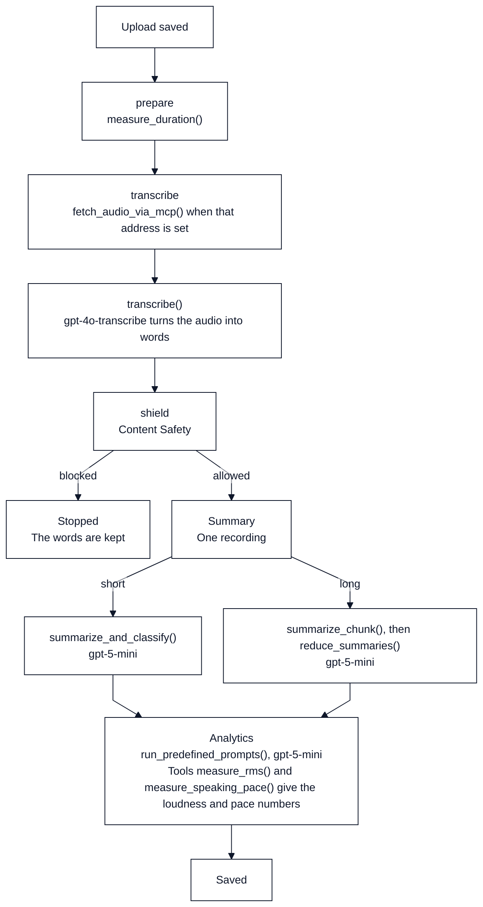
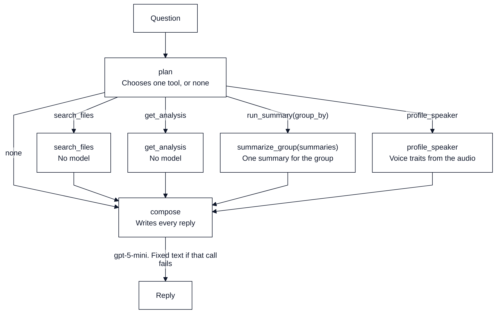

# Architecture

## Names

| Short form | Meaning |
| --- | --- |
| API | application programming interface |
| HTTP | Hypertext Transfer Protocol |
| JSON | JavaScript Object Notation |
| JWT | JSON Web Token |
| IP | Internet Protocol address |
| URL | Uniform Resource Locator |
| UI | user interface |
| SQL | Structured Query Language |
| NoSQL | a store that is not queried with Structured Query Language |
| DB | database |
| MCP | Model Context Protocol |

## System

A signed-in request enters through Front Door. The API answers a question, queues an upload, or writes the grouped summaries.

## This machine

What `docker compose up` starts.

## One recording

One saved file is measured, transcribed, checked, summarized, then run through the ticked Analytics prompts on gpt-5-mini. Loudness and pace numbers come from measuring tools.

## One question

| | Azure | Mock |
| --- | --- | --- |
| Plan | `gpt-5-mini` | Fixed rules |
| Reply | `gpt-5-mini` writes every reply, including greetings, help, and tool errors. Fixed text only when that call fails | Fixed rules |
| Voice questions | Gender, age, accent, emotion, or who is speaking call `profile_speaker` on the recording named in the question, otherwise the newest. The audio comes through the MCP `fetch_audio` tool (a direct blob read when `MCP_AUDIO_URL` is unset or the call fails) | Same |
| Temperature | Empty unless `AZURE_OPENAI_CHAT_TEMPERATURE` is set | |

The steps that answer one question.

## Call path

Which file calls the next.

```mermaid
%%{init: {"theme": "base", "htmlLabels": true, "securityLevel": "antiscript", "themeVariables": {"fontFamily": "monospace", "fontSize": "15px", "primaryColor": "#ffffff", "primaryTextColor": "#0f172a", "primaryBorderColor": "#0f172a", "lineColor": "#0f172a", "background": "#ffffff"}, "flowchart": {"htmlLabels": true, "curve": "linear", "padding": 18, "nodeSpacing": 28, "rankSpacing": 72, "wrappingWidth": 480, "useMaxWidth": false}}}%%
flowchart LR
  streamlit["<span style='font-weight:normal'>streamlit_app.py</span> | <b>render_assistant()</b><br><span style='font-size:11px;color:rgb(148,163,184)'>frontend/streamlit_app.py</span><br><i><span style='font-size:11px;color:rgb(148,163,184);font-family:Courier'>Opens the assistant.</span></i>"] --> assistant["<span style='font-weight:normal'>assistant_ui.py</span> | <b>upload()</b>, <b>chat()</b><br><span style='font-size:11px;color:rgb(148,163,184)'>frontend/assistant_ui.py</span><br><i><span style='font-size:11px;color:rgb(148,163,184);font-family:Courier'>Sends what you picked.</span></i>"]
  assistant --> client["<span style='font-weight:normal'>api_client.py</span><br><span style='font-size:11px;color:rgb(148,163,184)'>frontend/api_client.py</span><br><i><span style='font-size:11px;color:rgb(148,163,184);font-family:Courier'>Sends the request.</span></i>"]
  client -->|"upload()"| files["<span style='font-weight:normal'>files.py</span> | <b>upload_files()</b><br><span style='font-size:11px;color:rgb(148,163,184)'>backend/app/api/routes/files.py</span><br><i><span style='font-size:11px;color:rgb(148,163,184);font-family:Courier'>Saves the recording.</span></i>"]
  client -->|"chat()"| chat
  files -->|"enqueue_analysis()"| tasks
  files --> service["<span style='font-weight:normal'>analysis/service.py</span> | <b>run_file_analysis()</b>, <b>run_graph()</b><br><span style='font-size:11px;color:rgb(148,163,184)'>backend/app/analysis/service.py</span><br><i><span style='font-size:11px;color:rgb(148,163,184);font-family:Courier'>Runs the analysis.</span></i>"]
  service --> graphPy["<span style='font-weight:normal'>analysis/graph.py</span> | <b>run_graph()</b><br><span style='font-size:11px;color:rgb(148,163,184)'>backend/app/analysis/graph.py</span><br><i><span style='font-size:11px;color:rgb(148,163,184);font-family:Courier'>Microsoft Agent Framework works through one recording.<br>First the words, then the summary, then the Analytics prompts.</span></i>"]
  tasks["<span style='font-weight:normal'>jobs/tasks.py</span> | <b>analyze_file_task()</b><br><span style='font-size:11px;color:rgb(148,163,184)'>backend/app/jobs/tasks.py</span><br><i><span style='font-size:11px;color:rgb(148,163,184);font-family:Courier'>Runs the queued job.</span></i>"] --> service
  chat["<span style='font-weight:normal'>chat.py</span> | <b>chat()</b><br><span style='font-size:11px;color:rgb(148,163,184)'>backend/app/api/routes/chat.py</span><br><i><span style='font-size:11px;color:rgb(148,163,184);font-family:Courier'>Answers the question.</span></i>"] --> agent["<span style='font-weight:normal'>chat/agent.py</span> | <b>run_chat_agent()</b>, <b>execute_tool()</b><br><span style='font-size:11px;color:rgb(148,163,184)'>backend/app/chat/agent.py</span><br><i><span style='font-size:11px;color:rgb(148,163,184);font-family:Courier'>Microsoft Agent Framework answers one question<br>about this account's recordings.</span></i>"]
  agent --> tools["<span style='font-weight:normal'>chat/tools.py</span> | <b>run_summary(group_by)</b><br><span style='font-size:11px;color:rgb(148,163,184)'>backend/app/chat/tools.py</span><br><i><span style='font-size:11px;color:rgb(148,163,184);font-family:Courier'>Asks for a summary.</span></i>"]
  tools --> summary["<span style='font-weight:normal'>summarize_group.py</span> | <b>summarize_group(summaries)</b><br><span style='font-size:11px;color:rgb(148,163,184)'>backend/app/analysis/summarize_group.py</span><br><i><span style='font-size:11px;color:rgb(148,163,184);font-family:Courier'>Writes one summary for the group.</span></i>"]
  graphPy --> mcp["<span style='font-weight:normal'>mcp_audio.py</span> | <b>fetch_audio_via_mcp()</b><br><span style='font-size:11px;color:rgb(148,163,184)'>backend/app/analysis/mcp_audio.py</span><br><i><span style='font-size:11px;color:rgb(148,163,184);font-family:Courier'>Reads the audio.</span></i>"]
  graphPy --> intelligence["<span style='font-weight:normal'>intelligence.py</span> | <b>get_intelligence()</b><br><span style='font-size:11px;color:rgb(148,163,184)'>backend/app/analysis/providers/intelligence.py</span><br><i><span style='font-size:11px;color:rgb(148,163,184);font-family:Courier'>Azure OpenAI.<br>Transcribes the audio and writes the insights.</span></i>"]
  graphPy --> layer2["<span style='display:inline-block;width:19ch;text-align:right;font-weight:400'>llm_options.py</span> | <b>run_predefined_prompts()</b><br><span style='display:inline-block;width:19ch;text-align:right;font-weight:400'></span> | gpt-5-mini<br><span style='display:inline-block;width:19ch;text-align:right;font-weight:400'>SignalTools</span> | <b>measure_rms()</b><br><span style='display:inline-block;width:19ch;text-align:right;font-weight:400'></span> | <b>measure_speaking_pace()</b><br><span style='font-size:11px;color:rgb(148,163,184)'>backend/app/analysis/llm_options.py</span><br><i><span style='font-size:11px;color:rgb(148,163,184);font-family:Courier'>Analytics.<br>Predefined AI prompts; loudness and pace numbers<br>come from measuring tools.</span></i>"]
```

## Local and cloud

| | Local | Cloud |
| --- | --- | --- |
| Interface | Uvicorn | Container App, 2 copies growing to 8 |
| Queue | Redis and Celery | Service Bus |
| Schedule | Celery beat | Every 15 minutes |
| Files | Azurite, then `fetch_audio` when `MCP_AUDIO_URL` is set | Blob. The bytes are already loaded |
| Database | PostgreSQL 16 | One server per region, plus a standby in another zone |
| Models | Azure OpenAI and Content Safety when `LLM_PROVIDER` and `SAFETY_PROVIDER` are `azure` (as on this machine). Mock with no keys, the `.env.example` default | Azure OpenAI and Content Safety |
| Front door | none on this machine | Front Door, then API Management |
| Work | Inline in tests. Celery in Compose | One worker copy. The ceiling is 20 and no rule adds a copy |
| Account limit | 120 a minute when the limiter is on | 120 a minute |
| Trace | Langfuse when both keys are set | Same send. A failed send leaves the file result in place |

[Scaling](scaling.md)
