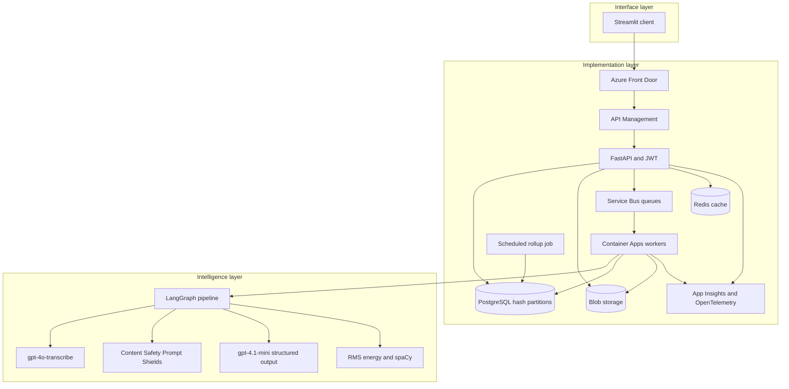
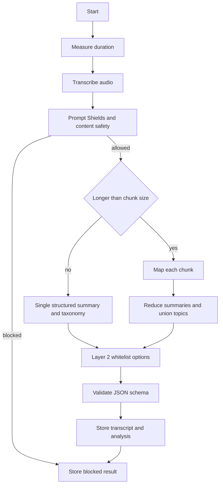

# Architecture

Voice Analytics has three layers. The interface is a narrow Streamlit client. The implementation layer stores data, authenticates users, and runs background work. The intelligence layer turns audio into a transcript, a summary, a taxonomy, and optional Layer 2 features.

## Layers

Source: [diagrams/system-architecture.mmd](diagrams/system-architecture.mmd). SVG: [diagrams/system-architecture.svg](diagrams/system-architecture.svg).

The browser talks only to Streamlit. Streamlit calls FastAPI with the bearer token. That keeps auth and file bytes on the server side of the UI.

## Analysis pipeline

LangGraph is the orchestrator. Duration is measured from the WAV header and samples, not guessed by the model. Transcription uses `gpt-4o-transcribe` when `LLM_PROVIDER=azure`, or a deterministic stand-in when `LLM_PROVIDER=mock`. Content Safety runs before any summary call. If the transcript is blocked, the model is not called.

Summaries use one structured call when the transcript fits in `CHUNK_CHARS` (default 4000). Longer transcripts are map-reduced: each chunk returns a partial summary and topic lists, then a reduce call merges them. Topic lists are unioned so a later chunk cannot be dropped. `gpt-4.1-mini` is asked for JSON that matches a strict JSON schema. The API checks that payload again with Pydantic before it is stored.

Layer 2 runs only the options stored on the user. Those options come from a server-side catalog. RMS and speaking pace are computed in-process. Nouns and adjectives come from spaCy `en_core_web_sm`. Sentiment uses a fixed lexicon. None of these steps accept a free-form system prompt.

## Local and production brokers

| Concern | Local `docker compose` | Production Terraform |
| --- | --- | --- |
| API | Uvicorn container | Container App, min 2, max 8 |
| Queue | Redis + Celery, worker started with beat | Service Bus queues and a Container App worker |
| Schedule | Celery beat inside the worker | Container Apps Job, cron `*/15 * * * *` |
| Objects | Azurite | Azure Blob, ZRS, private container |
| Database | Postgres 16 | Flexible Server 16, hash partitions |
| Models | Mock providers, no keys | Azure OpenAI and Content Safety |
| Traces | OpenTelemetry off unless configured | OpenTelemetry on; Langfuse when keys exist |

`ANALYSIS_MODE=inline` runs the pipeline in the API process. Tests use that mode. Compose uses `celery`. Production sets `BROKER=servicebus`, and the API publishes `{kind, file_id, user_id}` to the `transcription` queue. The worker process `python -m app.jobs.service_bus_worker` consumes `transcription`, `llm-layer1`, `llm-layer2`, and `rollup`.

The four queues are real infrastructure. Today a message on any analysis queue runs the full pipeline, which is idempotent. Splitting transcription and LLM into separate consumers is a scale step, not a schema change. See [scaling.md](scaling.md).

## Observability

OpenTelemetry is initialized when `OTEL_ENABLED=true`. If `OTEL_EXPORTER_OTLP_ENDPOINT` is set, spans go to that OTLP HTTP endpoint. FastAPI is instrumented, and each pipeline node opens a span.

Langfuse receives a generation observation for map, reduce, single-shot, and rollup calls when both `LANGFUSE_PUBLIC_KEY` and `LANGFUSE_SECRET_KEY` are set. Missing keys disable it. A Langfuse export error is logged and does not fail the analysis.

Terraform also creates Log Analytics and Application Insights per region. Point the OTLP endpoint at a collector that forwards to Azure Monitor if you want one trace pipeline for API spans and model spans.
