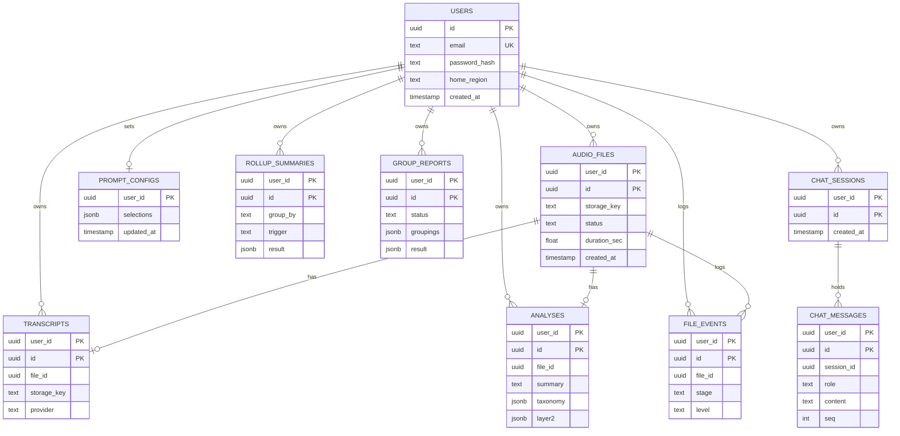
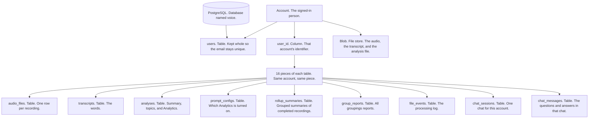
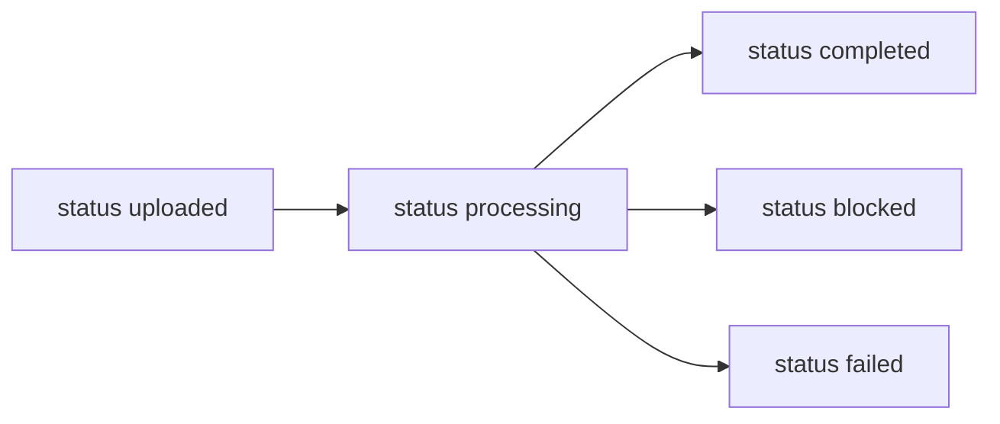
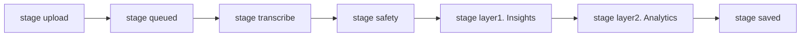

# Data model

## Names

| Short form | Meaning |
| --- | --- |
| ID | identifier |
| PK | primary key |
| UK | unique key |
| UUID | universally unique identifier |
| JSON | JavaScript Object Notation |
| jsonb | binary JSON, the column type used for structured fields |

[backend/sql/001_schema.sql](../backend/sql/001_schema.sql)

Each box is a table in the PostgreSQL database named voice. The account is the signed-in person. The users table holds that person.



| Table | What it stores |
| --- | --- |
| `users` | Email, hashed password, home region |
| `audio_files` | The recording, its length, and where processing stands |
| `transcripts` | The words |
| `analyses` | Summary, topics, and Analytics |
| `prompt_configs` | Which Analytics this account turned on |
| `rollup_summaries` | Combined summary of completed recordings |
| `group_reports` | The All groupings report: every grouping, code stats, and an AI summary per group |
| `file_events` | The processing log |
| `chat_sessions` | One chat for this account |
| `chat_messages` | The questions and answers in that chat |

## Rows

Where one account's rows and files live. Account is the person. PostgreSQL splits each table below into 16 pieces and keeps that account's rows in the same piece.



## Status

Values of the status column on the audio_files table.



## Stages

The order of work recorded for one file. layer1 is Insights. layer2 is Analytics.



## Summaries `group_by`

| `group_by` | |
| --- | --- |
| `user` | All recordings. The key is `all` |
| `taxonomy_label` | Topic |
| `day` `week` `month` | Calendar |
| `sentiment` | Sentiment |

## Blob keys

Paths in the Blob file store. These are files, not database tables.

```text
users/{user_id}/audio/{file_id}.{ext}
users/{user_id}/transcripts/{file_id}.json
users/{user_id}/analysis/{file_id}.json
```

| | |
| --- | --- |
| `ext` | `wav` `mp3` `m4a` `ogg` `flac` |
| Download | Under that account's prefix |
| Delete | The three objects and the rows. In Azure, Blob versioning keeps each old version for 7 days, counted from when it was written. Then a lifecycle rule purges it |
| Run again | Updates the transcript and the analysis. In Azure the replaced versions are purged the same way |
| `home_region` | `local` on this machine. One cloud region holds the account |
