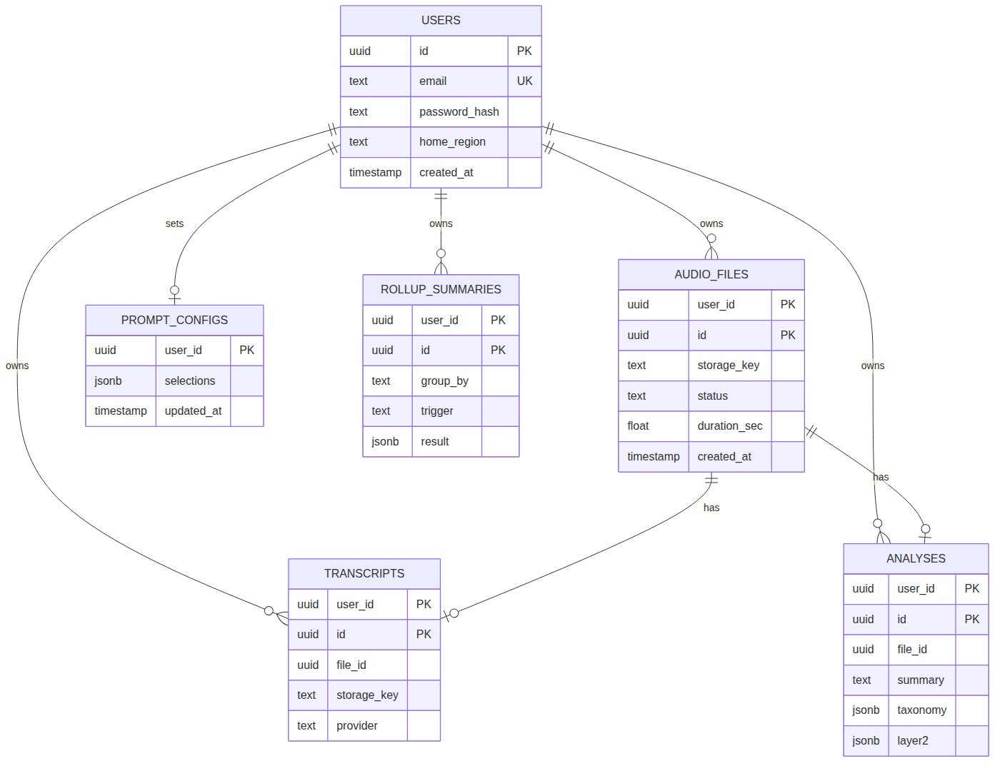
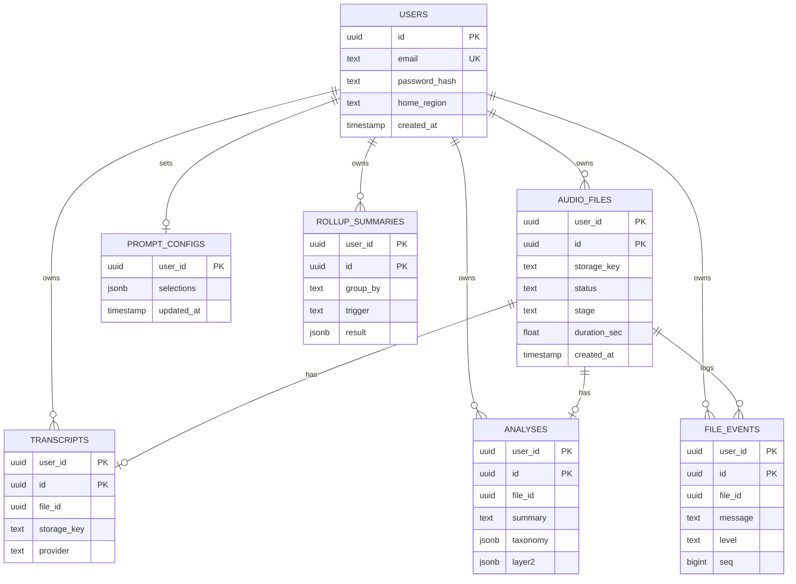

# Data model and storage keys

Every tenant-owned row carries `user_id`. PostgreSQL hash-partitions those tables into 16 physical partitions. The application does not choose a partition. Postgres does, which means a query that filters on `user_id` prunes the other partitions.

The `users` table is the exception. A unique email cannot be enforced on a hash-partitioned table unless the email is part of the partition key. The account row stays unpartitioned. Audio, transcripts, analyses, prompt configuration, rollups, and file events are partitioned.





The executable schema is [backend/sql/001_schema.sql](../backend/sql/001_schema.sql). Primary keys on partitioned tables are `(user_id, id)` or, for prompt config, `(user_id)` alone. Foreign keys to `audio_files` use the composite `(user_id, file_id)` because a unique key on a partitioned table must include the partition column.

## Tables

| Table | Partition | What it stores |
| --- | --- | --- |
| `users` | none | Email, password hash, home region |
| `audio_files` | `HASH(user_id)` modulus 16 | Filename, byte size, sha256, status, stage, duration, blob key |
| `transcripts` | `HASH(user_id)` | Transcript text and blob key, one row per file |
| `analyses` | `HASH(user_id)` | Summary, taxonomy, Layer 2 JSON, block reason |
| `prompt_configs` | `HASH(user_id)` | Whitelisted Layer 2 selections |
| `rollup_summaries` | `HASH(user_id)` | Aggregate job output |
| `file_events` | `HASH(user_id)` | Timestamped pipeline log lines for that user's jobs |

`audio_files.status` is `uploaded`, `processing`, `completed`, `blocked`, or `failed`. `stage` is `upload`, `queued`, `transcribe`, `safety`, `layer1`, `layer2`, or `saved`. Analysis rows use `completed`, `blocked`, or `failed`.

`file_events` stores the message, stage, level (`info` or `error`), optional duration, filename, and a sequence number used to return the newest line first. Deleting a file deletes its events.

`rollup_summaries.group_by` is `user`, `taxonomy_label`, `week`, or `sentiment`. `trigger` is `schedule` or `on_demand`.

Child partitions are named `{table}_p0` through `{table}_p15`.

## Object keys

Blobs live in one private container (`voice` by default):

```text
users/{user_id}/audio/{file_id}.{ext}
users/{user_id}/transcripts/{file_id}.json
users/{user_id}/analysis/{file_id}.json
```

`ext` is one of `wav`, `mp3`, `m4a`, `ogg`, `flac`. The API rejects any other extension and any key that does not start with `users/{user_id}/`. Deletes remove the audio object, the transcript object, and the analysis object, then delete the audio row. Child rows cascade.

Transcript JSON is `{ "text", "provider" }`. Analysis JSON repeats the summary, taxonomy, Layer 2 object, status, and block reason so the blob can be read without the database.

## Why this shape

- A list call is always `WHERE user_id = $1`, so it hits one hash bucket.
- Blob layout matches the database key. A leaked container listing still groups objects by user, and the API refuses cross-user keys.
- Re-running analysis updates the transcript and analysis rows for that file instead of inserting duplicates. Both tables have `UNIQUE (user_id, file_id)`.
- `home_region` on the user is the hook for pinning a person to one of the N regional stacks. The POC stores `local`. Production routing is described in [scaling.md](scaling.md).
