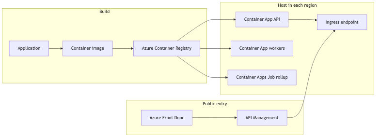
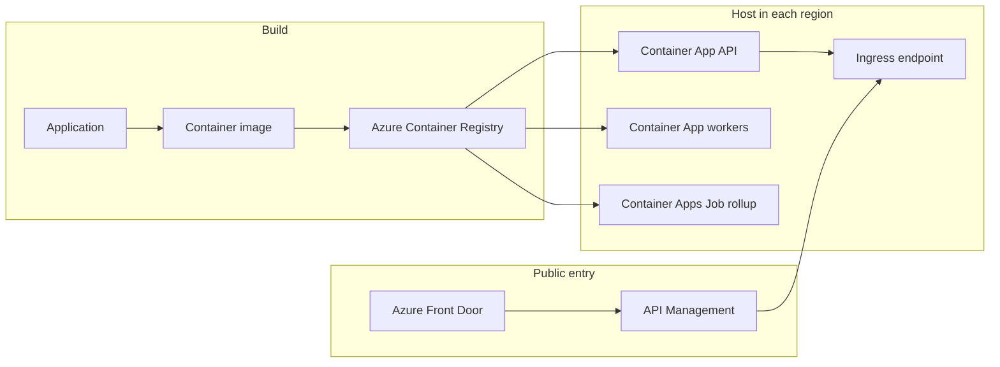

> Applicable only for cloud provisioning. This file is used only when deployed to the cloud with a multi-region deployment.

# Deploy path

[SVG](deploy-path.svg) · [source](deploy-path.mmd)

```mermaid
flowchart LR
  subgraph build [Build]
    APP[Application]
    IMG[Container image]
    ACR[Azure Container Registry]
    APP --> IMG --> ACR
  end

  subgraph host [Host in each region]
    API[Container App API]
    WK[Container App workers]
    JOB[Container Apps Job rollup]
    EP[Ingress endpoint]
    ACR --> API
    ACR --> WK
    ACR --> JOB
    API --> EP
  end

  subgraph edge [Public entry]
    FD[Azure Front Door]
    APIM[API Management]
    FD --> APIM --> EP
  end
```
