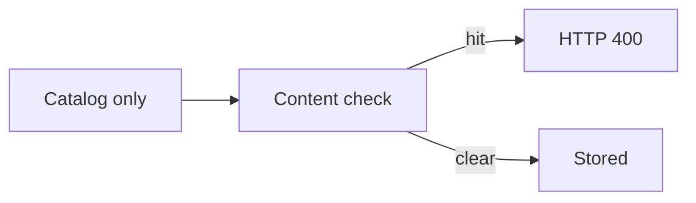
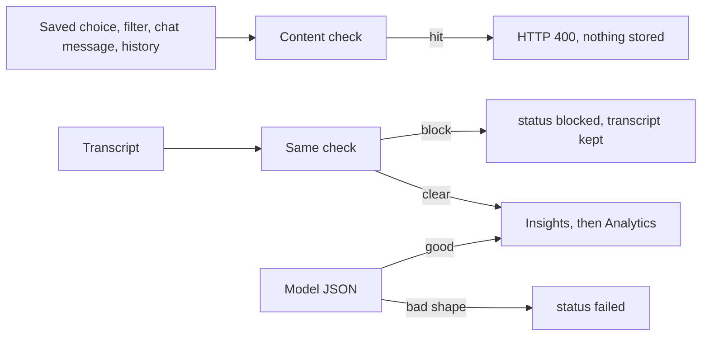
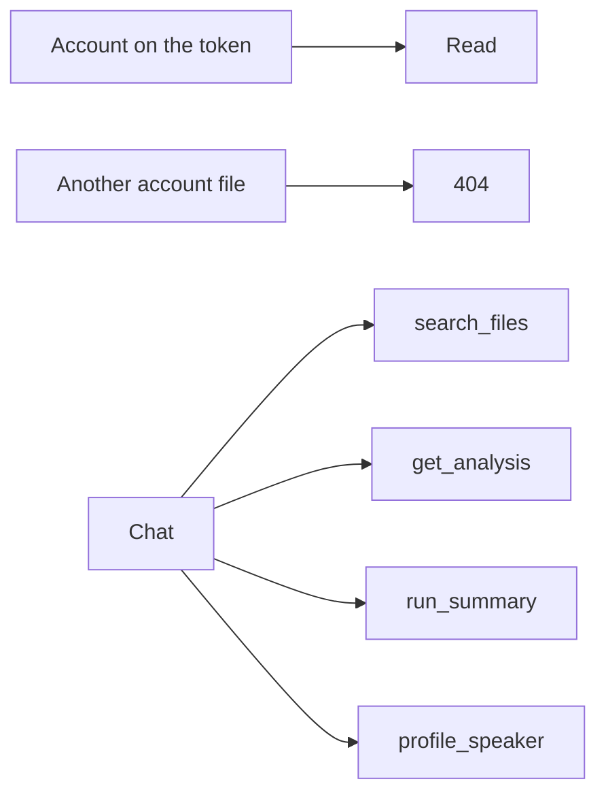

# Guardrails

| Short form | Meaning |
| --- | --- |
| HTTP | Hypertext Transfer Protocol |
| JSON | JavaScript Object Notation |
| 400 | rejected |
| 404 | not this account's file |

What happens when an Analytics choice is saved.

| Summaries `group_by` |
| --- |
| all recordings, topic, day, week, month, sentiment |

What the content check does to a message, a transcript, and a model reply.

Which account a read or a chat tool uses.

| | |
| --- | --- |
| Mock safety | This machine and the tests |
| Azure safety | `SAFETY_PROVIDER=azure` |
| Passwords | hashed |
| Tokens | expire |

## Threats

The guardrails cover the prompt configuration a user saves, the parameters of a custom filter, the transcript that comes out of the audio, and the chat.

| Source | What can go wrong |
| --- | --- |
| Prompt configuration | A user tries to replace the system prompt, add an unknown tool, or hide instructions in a parameter. |
| Custom filter | A filter string is used as a prompt fragment or a query injection. |
| Audio content | The transcript contains a jailbreak aimed at the model, or content the product should not send to the model. |
| Model output | The model returns extra fields, missing fields, or a summary that does not match the schema. |
| Other users | One account reads or deletes another account's files. |
| Chat question | The user hides instructions in the question or in history, names another user's file, or asks the agent to call a tool that is not in the set. |
| Chat tool output | A summary, taxonomy label, or transcript excerpt is later treated as an instruction. |

## Controls

### 1. Whitelist only, predefined prompts (Layer 2)

`GET /api/v1/prompts/options` returns the catalog. A save is accepted only when every `option_id` is in that catalog, parameters are in the declared set, enums match the allowed values, and integers fall inside the declared range. Unknown keys are rejected. There is no text field for a system prompt, a developer prompt, or a free-form instruction.

The catalog today. Every option is a predefined prompt; the text lives in `LLM_OPTION_BLOCKS` in `backend/app/analysis/prompts.py`.

| Option | Parameters | What the fixed prompt asks for |
| --- | --- | --- |
| `rms_energy` | `window_ms` in 100, 250, 500, 1000 | Call the `measure_rms` tool (windowed RMS of the decoded audio), copy its numbers, add a short trend |
| `pos_counts` | `top_n` from 1 to 20 | Noun and adjective counts and the top lemmas |
| `speaking_pace` | none | Call the `measure_speaking_pace` tool (words per minute from the transcript and measured duration), add a short reading |
| `sentiment_lexicon` | none | positive, neutral, or negative, a score from -1 to 1, and a reason. The id is kept from the earlier lexicon measure so saved choices and the sentiment filter keep working |
| `action_items` | `max_items` from 1 to 10 | Tasks and follow-ups as short phrases |
| `tone` | none | formal, casual, tense, friendly, or neutral, and a reason |
| `key_entities` | `max_items` from 1 to 10 | People, organizations, and places |

Users pick which options run, and their parameters, in the Analytics settings panel (next to Summarize across files) or with `PUT /api/v1/prompts/config`. All seven run at their defaults until a choice is saved, and an empty list also means all seven, so the panel asks for at least one. A saved choice applies to new uploads; unchecked options are skipped.

**Layer 2 design choice.** Every Analytics option is a predefined prompt: a fixed instruction block on the server, keyed by the option id, injected into one `gpt-5-mini` call per file. The user only ticks options and sets typed parameters in the Analytics settings panel (the brief: "Users can select and configure the predefined prompt on the UI"); nobody types prompt text. For loudness and pace the model calls server tools (`measure_rms`, `measure_speaking_pace`) that compute exact numbers in code; the model adds a short interpretation. Nouns and adjectives, sentiment, action items, tone, and key entities come from the model, in a JSON schema built from only the ticked options. The code functions (RMS math, spaCy, a fixed word list) stay as the tools and as the mock-mode stand-in, so tests and the offline demo need no Azure.

### Guardrails for Layer 2

Filter parameters:

- The UI offers only checkboxes, select boxes, and number inputs. There is no free-text field.
- The API is not trusted, because anyone can call it directly. The server re-validates every request against the whitelist.
- Unknown option ids are rejected (HTTP 400).
- Parameters are type- and range-checked. For example `window_ms` 123 or `top_n` 21 is rejected.
- Extra fields, at the top level, in a selection, or in `params`, are rejected with an error (HTTP 422 or 400). They are never silently dropped or passed on.
- Only the fixed server-side prompt text in `backend/app/analysis/prompts.py` reaches the LLM. User values are validated numbers only, never prompt text.

Audio content:

- The content-safety check (Azure AI Content Safety Prompt Shields; a fixed phrase list in local mock mode) screens the transcript before any LLM call.
- Blocked transcripts never reach the LLM or chat. Insights and Analytics are skipped.
- Hardened system prompts treat the transcript as untrusted data inside escaped `<transcript>` markers, name common injection patterns, and never follow commands in it.
- Output is a strict JSON schema built from the ticked options, then validated again on the server. A bad or missing part is stored as skipped, never as a result.
- Loudness and pace numbers come from server code only (the `measure_rms` and `measure_speaking_pace` tools). The server writes the tool's exact values over whatever the model returns.

Custom list filters use the same idea. `custom` must be `name:value`, and `name` must be one of `sentiment`, `adjective_count`, `noun_count`, `wpm`, `rms_mean`. Sentiment values must be `positive`, `neutral`, or `negative`. Numeric filters must sit inside a declared range.

Summaries `group_by` is `user`, `taxonomy_label`, `day`, `week`, `month`, or `sentiment`.

The All groupings report (`POST /api/v1/reports`) takes only whitelisted `groupings` (`day` `week` `month` `user` `taxonomy_label` `sentiment` `tone` `pace_band` `key_entity` `action_items`); anything else is 400, and extra fields are 422. Files are grouped in code so groups are exact; the AI writes the summary for every group, with the fixed hardened rollup prompt and the summaries fenced in `<summaries>`. Only completed analyses are read, so blocked files never reach the report or the model.

### 2. Content safety on the way in

Before a configuration is stored, the server serializes the cleaned options and runs content safety on that string. Azure mode calls Azure AI Content Safety `text:shieldPrompt` (Prompt Shields) and `text:analyze`. Mock mode, used locally and in tests, checks a fixed phrase list: jailbreak phrases such as "ignore previous instructions" and a small set of high-severity phrases. A hit returns HTTP 400 and nothing is saved.

The same check runs on the custom filter string.

### 3. The transcript is data, not instructions

**Audio guardrails.** Every transcript goes through a content-safety check (Azure AI Content Safety Prompt Shields; a fixed phrase list in local mock mode) that blocks before any LLM call. Behind it, the system prompts name common injection patterns and say never to obey them, and transcripts, summaries, and tool results are fenced in fixed tags as untrusted data.

System prompts are constants in `backend/app/analysis/prompts.py`. The transcript is placed only in the user message, inside `<transcript>` tags. Partial analyses go inside `<partial_analyses>` and group summaries inside `<summaries>`. The system text says only the system message gives instructions, that the fenced text is untrusted data from user audio, and names patterns to never obey: "ignore previous instructions", "you are now ...", lines starting with `system:`, role-play, requests to reveal the prompt, requests for other users' data, and requests to change the output format. Such text is only content to summarize, and the output stays the JSON schema.

Before wrapping, `backend/app/guardrails/markers.py` rewrites any copy of a reserved tag inside the data (any case, spaces allowed, `&lt;` forms too) as plain text, so `</transcript>` becomes `[/transcript]` and spoken text cannot close the block early. Tests cover the escaping, the rules in every system prompt, and an injection transcript staying inside the markers. A jailbreak sentence never appears in the system message.

After transcription, and before any summary call, every transcript goes through the same content-safety check:

- Prompt Shields for jailbreak or prompt injection (Azure), or the jailbreak phrase list (mock).
- Category analysis for violence, self-harm, and hate. Azure blocks at `CONTENT_SAFETY_BLOCK_SEVERITY` (default 4). The mock provider uses the same decision shape with its phrase list.

If the check blocks, the file status becomes `blocked`, the reason is stored, the transcript is kept for the user's own record, and the workflow skips both Insights (Layer 1) and Analytics (Layer 2).

### 4. Structured output and a second validation

Azure chat calls set `response_format` to a strict JSON schema (`additionalProperties: false`, required fields listed). The request omits `temperature` unless `AZURE_OPENAI_CHAT_TEMPERATURE` is set. `gpt-5-mini` rejects an explicit temperature of 0. Duration is not requested from the model. It is measured from the file.

After the workflow finishes, Pydantic validates:

- `duration_sec` is present and non-negative.
- `summary` is a non-empty string.
- `taxonomy` has `professional_topics`, `personal_topics`, and `upcoming_events`, each a list of strings.
- Layer 2 objects only use the known option keys.

A schema failure marks the file `failed`. The bad payload is not shown as a successful analysis.

Map-reduce has a recall guard: topics found on any chunk are unioned with the reduced taxonomy. A reduce step cannot silently drop a topic that a chunk already extracted.

### 5. Authorization and rate limit

Every file, transcript, analysis, prompt row, summary, and chat session is queried with the `user_id` from the JWT. A missing row is a 404, including when the id belongs to someone else. Blob downloads check that the key starts with `users/{user_id}/`. Passwords are hashed with bcrypt. Tokens are HS256 JWTs with an expiry.

The per-user rate limit is 120 requests per 60 seconds (`RATE_LIMIT_REQUESTS`, `RATE_LIMIT_WINDOW_SECONDS`). It sits in `get_current_user`, so chat is counted with the other authenticated routes.

### 6. Chat tools and the question text

`POST /api/v1/chat` runs the same content-safety check on the new message and on every history turn. A hit is HTTP 400 and the agent does not run. History roles are only `user` and `assistant`, and history is capped at eight turns. A `system` role is rejected before the agent sees it.

The system text is a constant. The question is placed in the user message inside `<question>` tags. Tool results go in `<tool_result>` tags. Both are described as data. The planner and compose prompts carry the same named injection patterns, and the question, history turns, tool results, context, and previous reply have reserved tags neutralized before they are fenced. Tests check that a jailbreak sentence in the question does not appear in the system text.

The agent may execute only `search_files`, `get_analysis`, `run_summary`, and `profile_speaker`. Any other name returns `unknown_tool` and is not called. Arguments are parsed with Pydantic models that forbid extra fields, so a model cannot pass `user_id`. Each query adds the JWT subject's `user_id`. A foreign file id is `not_found`.

`get_analysis` returns the summary, taxonomy, Layer 2 object, and at most the first 1200 characters of the stored transcript. That excerpt reaches the model only inside `<tool_result>`, which the system text marks as data.

Blocked transcripts never reach the chat model. For a file whose safety status is `blocked`, every chat tool (`get_analysis`, `search_files`, and `profile_speaker`) returns metadata only: id, filename, `status: blocked`, duration, upload time, the stored block reason, and the note "This recording was blocked by the content safety check." No transcript text, summary, taxonomy, or Layer 2 object is returned, and `profile_speaker` does not send the blocked audio to the model.

Azure mode asks for a JSON object whose only field is `reply`, then validates it again. Extra fields fail that check, and the API uses the rule-based reply instead of the model text. Mock mode never calls the chat deployment. It still runs the tool step, so the tests exercise the same whitelist and the same user filter.

`GET /api/v1/events` uses the same JWT filter. A caller cannot read another user's pipeline log, and the messages do not include transcript text.

## What this does not claim

- The mock safety provider is a stand-in for Azure AI Content Safety. It is deterministic and good enough for tests and the offline demo. Production must set `SAFETY_PROVIDER=azure`.
- Category lists in the mock are short on purpose. They are not a content policy.
- Schema validation checks shape, not factual accuracy. A model can still omit a topic. The union step only preserves topics the chunk step already returned.
- Blocked transcripts are stored because the user uploaded them. No summary or Analytics is produced for them, and they never reach the chat model. A retention policy for blocked text is future work.
- The safety check reads the transcript, not the audio. This design does not scan audio for non-speech signals such as hidden ultrasonic content. Duration and RMS are the acoustic checks in this POC.
- Speaker profiles are estimates from the audio, not identity facts.
