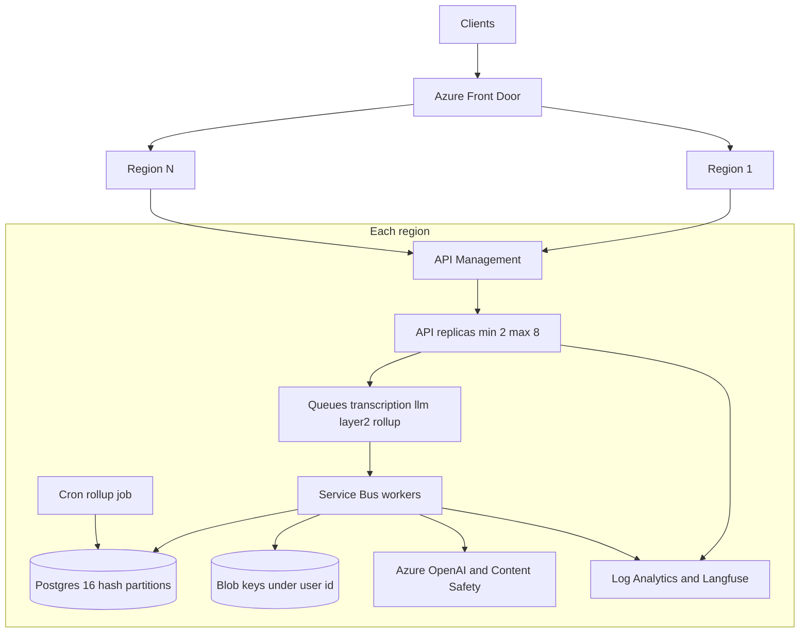

# Scaling

Target: **N regions**, each with **10,000 registered users** and **2,000 concurrent users**. Regions do not share audio or analysis rows. A user has one home region.




Terraform takes `regions` as a list. The length of that list is N. Each element is a `region_stack` module: network, Postgres, blob storage, Redis, Service Bus, Container Apps, a cron job, API Management, Key Vault, Azure OpenAI, and Content Safety. Front Door sits in a global resource group and origins point at each regional API.

## Planning case

These are assumptions, not measurements. Change them and the formulas still apply.

| Input | Symbol | Value |
| --- | --- | --- |
| Registered users per region | R | 10,000 |
| Concurrent users per region | C | 2,000 |
| Regions | N | variable |
| Audio files per registered user per day | F | 1 |
| Share of a day's uploads in a 4 hour peak | P | 0.80 |
| Mean audio duration | D | 3 minutes |
| Mean object size | S | 2 MB |
| Transcription wall clock | T_stt | 15 s |
| LLM wall clock, about two calls | T_llm | 4 s |
| Layer 2 CPU | T_l2 | 1 s |

Peak file rate:

```text
files_per_day        = R * F = 10,000
peak_files_per_sec   = files_per_day * P / (4 * 3600) = 0.56
```

In-flight work if one worker holds the whole pipeline:

```text
in_flight = 0.56 * (15 + 4 + 1) ≈ 11 tasks
```

That fits in a handful of worker replicas. The expensive wait is the transcription HTTP call, so production should not pin a CPU core to it.

## Request rate

Assume the 2,000 concurrent users split like this during the busy hour:

| Activity | Share | Interval | Requests/s |
| --- | --- | --- | --- |
| Library and polling | 70% | 10 s | 140 |
| Idle session | 20% | 60 s | 6.7 |
| Upload or waiting on analysis | 10% | 5 s | 40 |
| Total |  |  | about 187 |

FastAPI is async. List queries filter on `user_id` first, so Postgres prunes to one of 16 hash partitions. Two API replicas cover this rate and a deploy. The module sets min 2 and max 8.

Upload bandwidth at peak, if the 0.56 files/s are 2 MB each:

```text
0.56 * 2 MB ≈ 1.1 MB/s ≈ 9 Mbps
```

Blob ingress is not the bottleneck at this planning case. Playback is smaller still: 200 concurrent listeners at 128 kbps is about 26 Mbps.

## Workers and context limits

`CHUNK_CHARS` defaults to 4000 characters. A transcript under that size is one structured call to `gpt-4.1-mini`. A longer transcript is split, each chunk is summarized with its own schema, and a reduce call merges them. At most `MAX_CHUNKS` (20) chunks are sent. Topics found on any chunk are unioned back in, so the reduce step cannot drop them. Duration is computed locally and is not part of the model context.

Queues in each region:

| Queue | Job |
| --- | --- |
| `transcription` | Speech-to-text, then the rest of the pipeline |
| `llm-layer1` | Reserved for a later split of the summary stage |
| `llm-layer2` | Reserved for a later split of RMS and spaCy |
| `rollup` | Aggregate summaries |

The worker in this POC runs the full pipeline for any analysis message. That is idempotent. At 0.56 files/s it is enough. If transcription latency or file rate grows, move the LLM call onto `llm-layer1` so I/O wait does not scale the spaCy replicas. Suggested caps once split:

| Stage | In-flight at 0.56/s | Replica cap in Terraform |
| --- | --- | --- |
| Transcription, 15 s, async HTTP | 0.56 * 15 ≈ 9 | worker max 20 |
| Layer 1, 4 s | 0.56 * 4 ≈ 3 | same worker pool today |
| Layer 2, 1 s CPU | under 1 core | same worker pool today |
| API | 187 rps | min 2, max 8 |

The rollup job is a Container Apps Job on `*/15 * * * *`. It also runs when a user asks for it in the UI. The UI path calls the same function in the API process so the screen can show the result. The cron path calls `python -m app.jobs.run_scheduled_rollup`. A user is skipped when a scheduled rollup for `group_by=user` already exists inside the interval.

## Data plane per region

| Service | Choice | Why |
| --- | --- | --- |
| Postgres Flexible Server | GP D4ds v5, 128 GB, 16 hash partitions, public access off | 10k users, partition pruning, private subnet |
| Blob | ZRS, private container, versioning on | 10,000 * 2 MB = 20 GB/day. Hot set for 30 days is about 600 GB. Move older blobs to cool. |
| Service Bus | Standard, four queues | 0.56 messages/s does not need Premium. Premium is the step up for private networking and a higher SLA. |
| Redis | Standard C1 | Short cache. It is not the production queue. |
| Azure OpenAI | `gpt-4o-transcribe` and `gpt-4.1-mini`, Global Standard | Hosted API. Self-hosting a transcriber would remove the per-minute fee and add GPU capacity we do not need at 0.56 files/s. |
| Content Safety | S0 | Prompt Shields and category analysis in front of the model |
| Front Door | One global profile | Latency-based entry. The app stores `home_region` and should stick a user to that region. |
| API Management | Consumption | Auth, quota, and a stable regional front before the Container App |

Global identity is a small lookup, not a copy of the audio. Sign-up writes `email -> user_id -> home_region` in the region the user was routed to, and the email unique index lives in that region's `users` table. A second region must not create the same email. The practical approach is a tiny global directory (email, user id, home region) in the primary region, replicated read-only, or an external identity provider. The POC keeps that column and does not build the global directory.

Multiply every regional number by N. There is no cross-region join and no cross-region blob read on the request path.

## Cost notes

These are order-of-magnitude illustrations for **one region** at the planning case. Recheck the Azure price sheet before budgeting. Prices move, and transcription minutes dominate.

| Item | Rough monthly shape |
| --- | --- |
| Transcription | 10,000 files/day * 3 min * 30 days = 900,000 minutes. At a few tenths of a cent to about a cent per minute, this is the largest line, on the order of several thousand dollars. |
| `gpt-4.1-mini` | About 2 calls * 2k tokens * 10k files * 30 days. Mini pricing makes this hundreds of dollars, not thousands, unless map-reduce expands long files. |
| Content Safety | 300k text records/month. Often on the order of a few hundred dollars. |
| Postgres D4ds | A few hundred dollars. |
| Container Apps | Low hundreds at this replica count. |
| Blob, 600 GB hot | Tens of dollars, plus operations. |
| Service Bus Standard | Low tens of dollars. Premium is hundreds and is not required for this rate. |
| Front Door + API Management Consumption + Redis C1 + App Insights | Low hundreds combined. |
| Langfuse | Optional, separate from Azure. |

For N regions, multiply the regional lines. Front Door stays one profile. The global directory, if added, is tiny next to transcription.

The main cost lever is minutes of audio sent to `gpt-4o-transcribe`. Skipping silence, rejecting very long files, and keeping the planning case at one file per user per day matter more than the API replica count.

## Trade-offs

- Hosted Azure OpenAI instead of a self-hosted model. The POC has to run with no GPU, and 0.56 files/s does not justify a transcription cluster. The cost is per minute and the quota is regional.
- Hash partitions are fixed at 16. That is enough for 10k users in one database. Raising the modulus later means a new partitioned table and a copy, so 16 is chosen up front.
- The users table is not partitioned, so email stays unique. See [data-model.md](data-model.md).
- One worker function instead of three stage consumers. The queues exist so the split does not need a new contract. Doing it now would add failure states between stages for a rate that fits in one pool.
- On-demand rollup runs in the API. The scheduled run is a job. Both call `run_rollup`. A very large account could move the on-demand path onto the `rollup` queue.
- Active-active regions with a home-region pin, not a single write region. A region failure loses that region's availability until failover, and failover needs the global directory plus blob replication, which this module does not enable yet.

## Future work

- Split the pipeline across the four queues and scale them independently.
- ffmpeg normalization so mp3 and m4a get real duration and RMS.
- A global email directory in front of regional sign-up.
- Private endpoints for blob, Service Bus, and OpenAI.
- Geo-redundant blob plus a documented regional failover.
- Evaluation set for summary and taxonomy quality.
- Retention and deletion for blocked transcripts.
