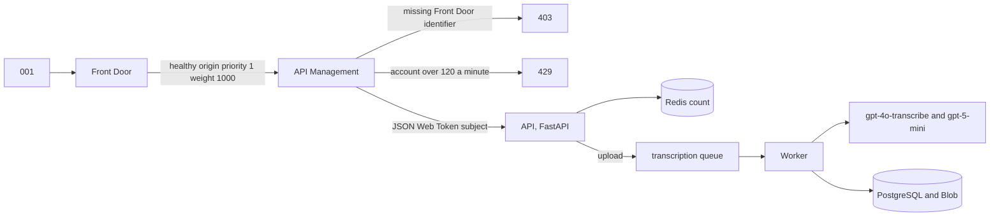
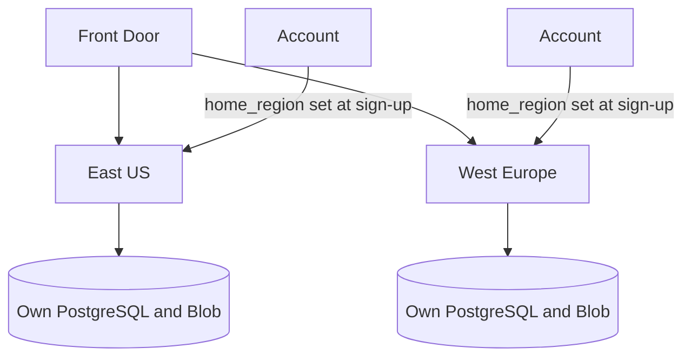
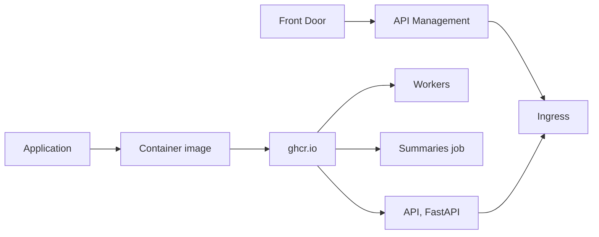
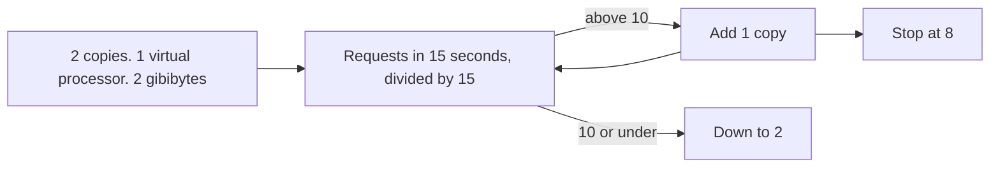
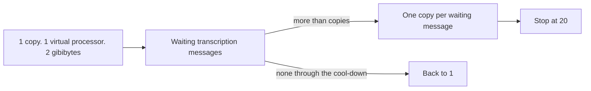
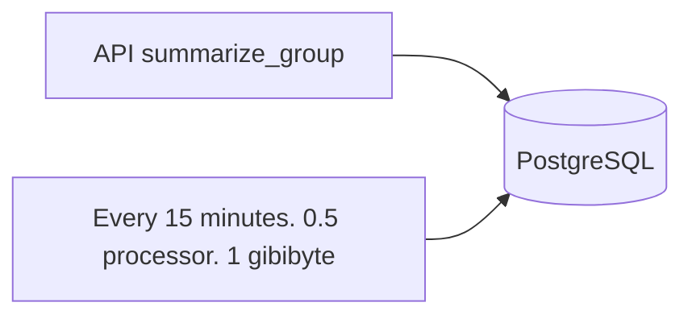
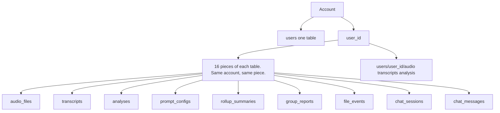

# Scaling

How the Azure design would handle one request, and how many copies of each part would run. This is a design with Terraform that CI validates; it is not a running deployment.

## Names

| Short form | Meaning |
| --- | --- |
| API | application programming interface |
| HTTP | Hypertext Transfer Protocol |
| IP | Internet Protocol address |
| JSON | JavaScript Object Notation |
| JWT | JSON Web Token |
| GiB | gibibyte |
| GB | gigabyte |
| vCPU | virtual central processing unit |
| MB | megabyte |
| llm | large language model. `llm-layer1` is Insights. `llm-layer2` is Analytics |

## Request 001

One signed-in upload, from the front door to the stored file.

## Where the account is stored

Which region's database and file store hold the account.

Front Door does not route by `home_region`. Both regions have the same priority and weight, so a call can land in the region that does not hold the account. That region has no row for it and answers 401.

## How a release is placed

Where the built image is started, and how a call reaches it. The image lives on ghcr.io (`api_image` and `worker_image`). It is built and pushed by hand. CI tests and validates only; there is no deploy step.

## API

When a copy of the FastAPI container app (`ca-api`) is added, and when the count returns to 2. Terraform sets no scale rule, so this is the Container Apps default HTTP rule.

## Worker

How many worker copies run. Terraform sets a Service Bus scale rule on the `transcription` queue.

A copy works one message at a time with a synchronous HTTP client. One file takes about 25 seconds, so one copy finishes about 0.04 files a second. The rule counts waiting messages, not the ones a copy is already working on. The Container Apps cool-down (300 seconds by default) keeps busy copies up between bursts. A busy copy removed in a scale-in stops in the middle of its job, and Service Bus delivers that message again once the lock expires.

## Summaries

Who writes the grouped summaries, and where they land.

## Fixed size, each region

| Component | Copies | Size |
| --- | --- | --- |
| API Management | 1 | Basic. 120 a minute on the account. 60 a minute per client IP (`X-Azure-ClientIP` from Front Door) |
| Redis | 1 | Standard C1. 1 GB |
| Service Bus | 1 | Standard. transcription, llm-layer1, llm-layer2, rollup. 5-minute lock |
| PostgreSQL | 1 plus a standby | version 16, 4 vCPU, 16 GiB, 128 GiB |
| Blob | 1 | Standard. Copied across zones and to the paired region |
| Front Door | 1 | Standard. Health check `GET /api/v1/health` every 120 seconds |
| gpt-4o-transcribe | 1 | Global Standard. 30 thousand tokens a minute |
| gpt-5-mini | 1 | Data Zone Standard. 80 thousand tokens a minute |
| Content Safety | 1 | S0 |

Known limit: the model quotas are below the plan peak. These are estimates, not measurements. The plan numbers imply about 3 minutes of audio per file (900,000 minutes a month, 10,000 files a day). At 0.56 files a second, `gpt-4o-transcribe` needs about 100 thousand tokens a minute (about 1,000 audio tokens per audio minute, from OpenAI's $6 per million audio tokens and its $0.006 a minute estimate), against 30 thousand here. `gpt-5-mini` gets at least three requests per file with the default options (Insights, and Analytics with its tool round trip) plus chat; at a few thousand tokens per file that is well above 80 thousand. Over the quota Azure answers 429. A failed transcription or Insights call marks the file failed and Service Bus delivers it again; a failed Analytics call is stored as skipped. Raise `capacity` in `ai.tf` after checking the subscription quota and a load test.

## Rows

How one account's rows are divided.

## Plan numbers, each region

| | |
| --- | --- |
| Accounts | 10,000 |
| Active at once | about 2,000 |
| Peak uploads | about 0.56 files a second |
| Busy-hour requests, worst case | about 1,020 a second: about 14 sessions with a file processing (0.56 files a second, about 25 seconds each) at 2 calls a second, and the other 1,986 on the chat check at 1 call every 2 seconds. The chat check only runs after a reply was cut off, for up to about 3 minutes, so this is an upper bound. Without it, file polling is about 28 a second plus chat turns |
| Polling per account | 2 calls a second while a file processes (`/files` and `/events`), which is 120 a minute, the per-account limit. One more call in that minute answers 429 |
| Transcription | about 900,000 minutes a month |
| Models | `gpt-4o-transcribe` and `gpt-5-mini` |
| Move an account | no automatic move |

## Workers and context limits

`CHUNK_CHARS` defaults to 4000 characters. A transcript up to that size is one structured call to `gpt-5-mini`. A longer transcript goes through map-reduce: it is split, each chunk is summarized with its own schema, and a reduce call merges them. At most `MAX_CHUNKS` (20) chunks are sent, so text after about 80,000 characters is not summarized. Topics found on any chunk are unioned back in, so the reduce step cannot drop them, up to 12 distinct items per list. Duration is computed locally and is not part of the model context. Analytics is one call that reads the first 24,000 characters of the transcript (`TRANSCRIPT_LIMIT` in `llm_options.py`); the pace tool still counts every word.

Queues in each region:

| Queue | Job |
| --- | --- |
| `transcription` | Speech-to-text, then the rest of the pipeline |
| `llm-layer1` | Reserved for a later split of the summary stage |
| `llm-layer2` | Reserved for a later split of the Analytics prompts (`gpt-5-mini` plus the measuring tools) |
| `rollup` | All groupings report jobs (`group_report`). The scheduled summary is its own job and on-demand summaries run in the API |

The worker in this POC runs the full pipeline for any analysis message. That is idempotent. Each copy works one message at a time with a synchronous HTTP client, about 25 seconds per file. 0.56 files/s keeps about 14 copies busy. The scale rule allows 20 copies, about 0.8 files/s. Above that the queue grows. If transcription latency or file rate grows, move the two LLM calls onto `llm-layer1` and `llm-layer2` so model wait does not scale the transcription replicas.

| Stage | In flight at 0.56/s | Copies in Terraform |
| --- | --- | --- |
| Whole file today (transcription, Insights, Analytics), about 25 s, synchronous HTTP | 0.56 * 25 ≈ 14 | worker 1 to 20, one waiting message per copy. 20 copies ≈ 0.8 files/s |
| Layer 1 once split, 4 s | 0.56 * 4 ≈ 3 | same worker pool today |
| Layer 2 once split, one `gpt-5-mini` call (two requests with the tool round trip) plus the RMS and pace tools | 0.56 * call seconds; the tools need under 1 core | same worker pool today |
| API | worst case about 1,020 rps | min 2, max 8. The default rule asks for about 100 copies at this rate, so the API stays at 8 |

### Queue order, locks and retries

- Each copy reads the four queues in turn: `transcription`, `llm-layer1`, `llm-layer2`, `rollup`. It drains one queue until no message arrives for 1 second, then moves on. All groupings report jobs on `rollup` wait behind a `transcription` backlog.
- Every queue has a 5-minute lock, the longest Service Bus allows. The code does not renew locks. A job that runs longer than 5 minutes is delivered again.
- When that happens, the late complete call fails, and so does the abandon in the error path. That stops the worker process, and Container Apps restarts it. A job that raises an error is abandoned and retried. Service Bus moves a message to the dead-letter queue after 10 deliveries (its default).
- File analysis writes are upserts, so a repeated job leaves one result.

### When summaries run

Grouped summaries are triggered two ways, and both call the same `run_rollup` function:

- **Scheduled, every 15 minutes.** A Container Apps Job on `*/15 * * * *` calls `python -m app.jobs.run_scheduled_rollup`. It gets the Azure OpenAI endpoint, key, and chat deployment, the same as the worker. It writes a `group_by=user` summary for each account with completed analyses, and skips an account that already has a scheduled summary inside the interval. This keeps an up-to-date overview ready without anyone waiting for it, and the 15-minute cadence bounds the model cost to at most one scheduled summary per account per interval.
- **On demand.** When a user asks in the UI or the chat, the API runs the summary in-process so the screen can show the result right away. `group_by` is one of `user`, `taxonomy_label`, `day`, `week`, `month`, or `sentiment`, with an optional time range.

Each group is summarized with the same chunk budget: if the summaries in a group add up to more than `CHUNK_CHARS`, they are split in half and summarized recursively, so one call stays inside the model context. Known limit: the split stops after 6 levels (64 parts). A part that is still over the budget is sent as it is, with at most its first 50 summaries.

## Data plane per region

| Service | Choice | Why |
| --- | --- | --- |
| Postgres Flexible Server | GP D4ds v5, 128 GB, zone-redundant HA, geo-redundant backups, 16 hash partitions, public access off | Zone failure stays inside the region. Geo-redundant backup is a copy of backups in the paired region, not a second live database. |
| Blob | GZRS, private container, versioning on, lifecycle rule | Zone and geo copies of objects. Reads stay in the home region until a storage failover is started. 10,000 * 2 MB = 20 GB/day. Versioning keeps the old bytes of a deleted or replaced blob. The lifecycle rule purges a previous version after 7 days, counted from when it was written. Azure runs the rule about once a day. |
| Service Bus | Standard, four queues, 5-minute lock | 0.56 messages/s does not need Premium. Microsoft makes every Service Bus tier zone redundant in regions with availability zones, with no setting. Premium is the private-network and geo-replication step, and it is a large fixed cost at this rate. |
| Redis | Standard C1 | Rate-limit counter. It is not the production queue. Azure creates a new Standard cache zone redundant (automatic zone allocation) in regions with availability zones; azurerm 4.81 uses API version 2024-11-01 and sends no zone setting, so that default applies. Known limit: Azure Cache for Redis retires on 2028-09-30, and since 2026-04-01 a tenant that had no Azure Cache for Redis before that date cannot create one. A deploy in such a tenant fails at this resource until it is moved to Azure Managed Redis, which is a Terraform change. |
| Azure OpenAI models | `gpt-4o-transcribe` on Global Standard and `gpt-5-mini` on Data Zone Standard, deployed in Microsoft Foundry in eastus2 and swedencentral (`openai_location`) | Microsoft Foundry is the hosting environment for both model deployments. `gpt-4o-transcribe` is speech-to-text. `gpt-5-mini` is analysis and chat. Hosted API. Self-hosting a transcriber would remove the per-minute fee and add GPU capacity we do not need at 0.56 files/s. `gpt-4o-transcribe` is offered only on Global Standard, and eastus and westeurope do not offer it, so the OpenAI account sits in another region of the same geography. Microsoft's retirement schedule (checked 2 October 2026) lists `gpt-4o-transcribe` 2025-03-20 for 15 October 2026 with no replacement named, and `gpt-5-mini` 2025-08-07 for 9 February 2027. Check it before an apply. |
| Content Safety | S0 | Prompt Shields and category analysis on every transcript, on saved prompt choices, and on chat input. The code sends only the first 10,000 characters of each text, so the rest of a longer transcript is not screened |
| Front Door | One global Standard profile | Entry in front of API Management. The app stores `home_region`, but Front Door does not use it. A call that lands in the other region answers 401. |
| Container Apps | Zone-redundant environment, consumption, apps subnet `/23` | Replicas can land in more than one zone. `/23` is the minimum for a consumption-only environment. |
| API Management | Basic, one unit | `rate-limit-by-key` is supported on Basic and not on Consumption. See the trade-offs below. |

Global identity is a small lookup, not a copy of the audio. Sign-up writes `email -> user_id -> home_region` in the region the user was routed to, and the email unique index lives in that region's `users` table. A second region must not create the same email. The practical approach is a tiny global directory (email, user id, home region) in the primary region, replicated read-only, or an external identity provider. The POC keeps that column and does not build the global directory.

Multiply every regional number by N. There is no cross-region join and no cross-region blob read on the request path.

## Why Azure

- The models the product depends on, `gpt-4o-transcribe` and `gpt-5-mini`, are available as managed deployments in Microsoft Foundry, next to Azure AI Content Safety (Prompt Shields). Speech-to-text, analysis, and the safety check stay inside one cloud. They do not all stay in one region: Global Standard may process the audio in any Azure region, and Data Zone Standard keeps `gpt-5-mini` text inside the US or EU data zone.
- Every other piece has a managed Azure service with zone redundancy and regional deployment: Postgres Flexible Server, GZRS Blob, Service Bus, Container Apps, API Management, and Front Door. One Terraform module (`region_stack`) can stamp out a full region, so adding a region is adding an entry to the `regions` list.
- Data residency at rest follows from the home-region model: a user's audio, transcripts, and analyses live in that region's database and storage account. Processing is wider. `gpt-4o-transcribe` is offered only on Global Standard, so the audio may be processed in any Azure region where Microsoft runs the model. `gpt-5-mini` uses Data Zone Standard, so summaries and chat stay inside the US or EU data zone. A strict residency need waits for a data-zone or regional transcription deployment.

## Trade-offs

- Hosted models instead of self-hosted ones. Both models are deployed in Microsoft Foundry. The POC has to run with no GPU, and 0.56 files/s does not justify a transcription cluster. The cost is per minute and the quota is regional.
- `gpt-4o-transcribe` for speech-to-text because it is a hosted transcription model with good accuracy on conversational audio and no infrastructure to run. `gpt-5-mini` for summaries, taxonomy, and chat because it supports strict JSON-schema output and is cheap enough per call that map-reduce on long transcripts stays in the hundreds of dollars a month, not thousands.
- Hash partitions are fixed at 16. That is enough for 10k users in one database. Raising the modulus later means a new partitioned table and a copy, so 16 is chosen up front.
- The users table is not partitioned, so email stays unique. See [data-model.md](data-model.md).
- One worker function instead of three stage consumers. The queues exist so the split does not need a new contract. Doing it now would add failure states between stages for a rate that one pool covers: about 14 busy copies at 0.56 files/s, with room up to 20 copies, about 0.8 files/s.
- On-demand rollup runs in the API. The scheduled run is a job. Both call `run_rollup`. A very large account could move the on-demand path onto the `rollup` queue.
- Active-active regions with a home-region pin, not a single write region. A region failure loses that region's availability until someone restores it. Geo-redundant Postgres backups and GZRS blobs make a restore possible in the paired region. They do not keep a live copy of each user's rows, and the app does not fail over by itself.
- API Management Basic instead of Consumption. Microsoft's policy reference lists `rate-limit-by-key` as supported on the classic and v2 gateways and not on Consumption. `rate-limit` on Consumption is per subscription key, and this API does not use subscription keys. Developer supports the per-key policy and has no SLA. Basic is the smallest tier with an SLA that can key the counter on `sub`. Microsoft rates one Basic unit at about 1,000 requests/s. The worst case here is about 1,020 requests/s, which is above that estimate, so one unit needs a load test before it is trusted. Standard is several times the Basic price without a feature this rate needs. Premium is the tier with zone redundancy and virtual-network injection. That cost is not justified for a gateway at this rate, so API Management is not zone redundant.
- The FastAPI limiter is the same 120 requests per 60 seconds per user, stored in Redis. API Management is the edge. Redis is the check that still runs in Compose and that still runs if a request reaches the container. Health, sign-up, login, meta, and the prompt catalog are not counted. Public API Management routes are limited per client IP instead, at 60 per 60 seconds. The key is the `X-Azure-ClientIP` header that Front Door sets, or the caller's IP when the header is missing. Behind Front Door the caller's IP is a Front Door edge address that many users share. While a file processes, the UI's own polling uses the whole 120 a minute.
- The Container App ingress allows only API Management's public IPs. API Management requires `X-Azure-FDID` to match the Front Door profile before it validates the JWT. Basic cannot join a virtual network, and Front Door Standard cannot private-link to API Management. A private path would be Front Door Premium plus API Management Premium. This module does not take that step.
- Zone redundancy that is turned on: Postgres Flexible Server (zones 1 and 2, with geo-redundant backups), the Container Apps environment, and GZRS blob. Service Bus and Redis Standard are zone redundant by Azure default in regions with availability zones, with no setting in Terraform. Zone redundancy that is documented and not turned on: API Management Basic, which needs Premium for zones. Cross-region replication of a user's rows is also not turned on.
