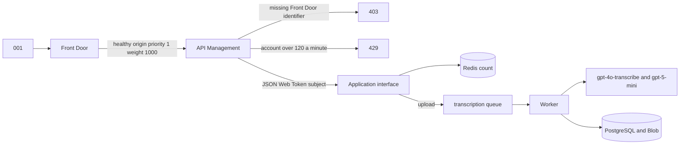
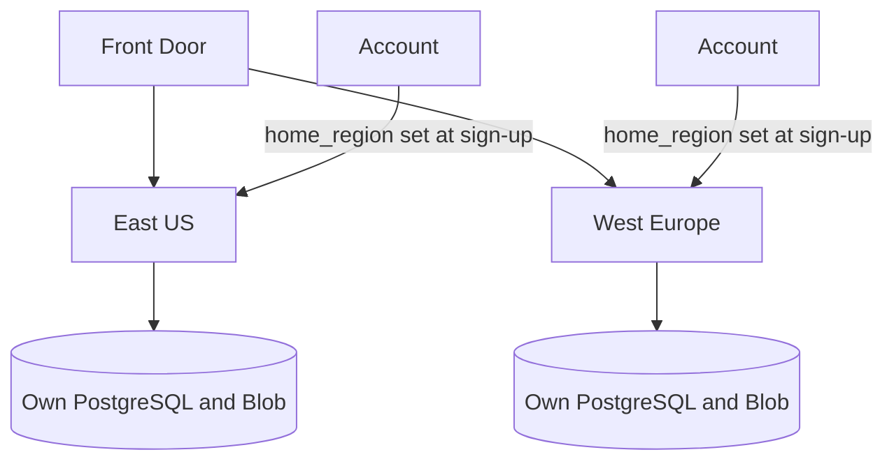
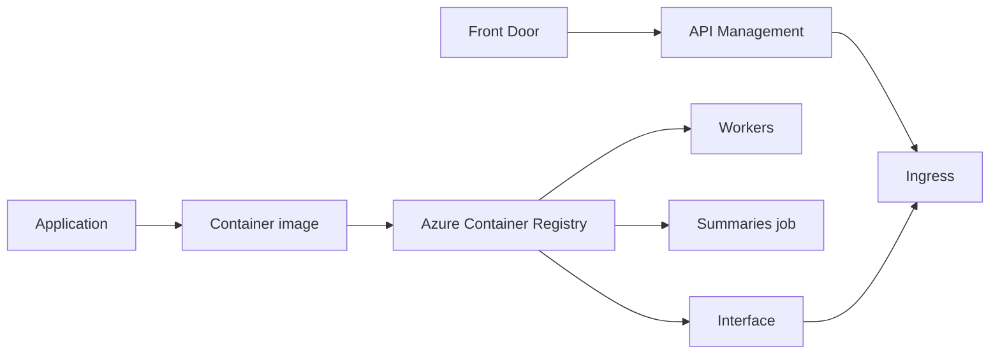
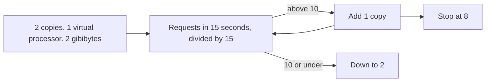
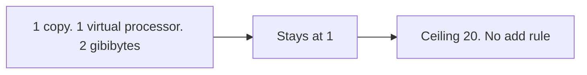
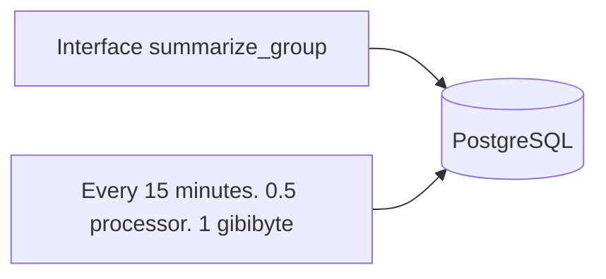
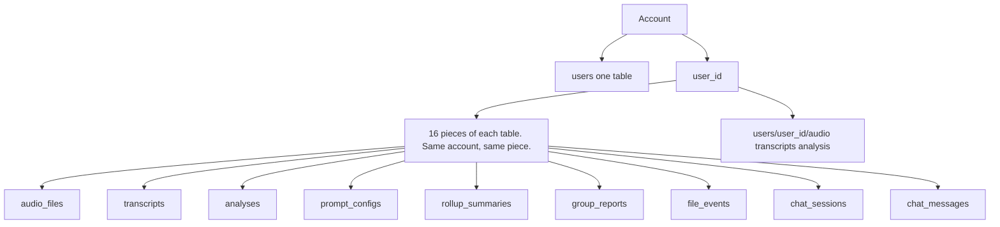

# Scaling

How the Azure design would handle one request, and how many copies of each part would run. This is a design with Terraform that CI validates; it is not a running deployment.

## Names

| Short form | Meaning |
| --- | --- |
| API | application programming interface |
| HTTP | Hypertext Transfer Protocol |
| IP | Internet Protocol address |
| JSON | JavaScript Object Notation |
| JWT | JSON Web Token |
| GiB | gibibyte |
| GB | gigabyte |
| vCPU | virtual central processing unit |
| MB | megabyte |
| llm | large language model. `llm-layer1` is Insights. `llm-layer2` is Analytics |

## Request 001

One signed-in upload, from the front door to the stored file.

## Where the account is stored

Which region's database and file store hold the account.

## How a release is placed

Where the built image is started, and how a call reaches it.

## Application interface

When a copy is added, and when the count returns to 2.

## Worker

How many worker copies run.

## Summaries

Who writes the grouped summaries, and where they land.

## Fixed size, each region

| Component | Copies | Size |
| --- | --- | --- |
| API Management | 1 | Basic. 120 a minute on the account. 60 a minute on the IP address |
| Redis | 1 | Standard C1. 1 GB |
| Service Bus | 1 | Standard. transcription, llm-layer1, llm-layer2, rollup |
| PostgreSQL | 1 plus a standby | version 16, 4 vCPU, 16 GiB, 128 GiB |
| Blob | 1 | Standard. Copied across zones and to the paired region |
| Front Door | 1 | Standard. Health check `GET /api/v1/health` every 120 seconds |
| gpt-4o-transcribe | 1 | 30 thousand tokens a minute |
| gpt-5-mini | 1 | 80 thousand tokens a minute |
| Content Safety | 1 | S0 |

## Rows

How one account's rows are divided.

## Plan numbers, each region

| | |
| --- | --- |
| Accounts | 10,000 |
| Active at once | about 2,000 |
| Peak uploads | about 0.56 files a second |
| Busy-hour requests | about 187 a second (most sessions poll every 10 seconds) |
| Transcription | about 900,000 minutes a month |
| Models | `gpt-4o-transcribe` and `gpt-5-mini` |
| Move an account | no automatic move |

## Workers and context limits

`CHUNK_CHARS` defaults to 4000 characters. A transcript under that size is one structured call to `gpt-5-mini`. A longer transcript goes through map-reduce: it is split, each chunk is summarized with its own schema, and a reduce call merges them. At most `MAX_CHUNKS` (20) chunks are sent. Topics found on any chunk are unioned back in, so the reduce step cannot drop them. Duration is computed locally and is not part of the model context.

Queues in each region:

| Queue | Job |
| --- | --- |
| `transcription` | Speech-to-text, then the rest of the pipeline |
| `llm-layer1` | Reserved for a later split of the summary stage |
| `llm-layer2` | Reserved for a later split of the Analytics prompts (`gpt-5-mini` plus the measuring tools) |
| `rollup` | Aggregate summaries |

The worker in this POC runs the full pipeline for any analysis message. That is idempotent. At 0.56 files/s it is enough. If transcription latency or file rate grows, move the two LLM calls onto `llm-layer1` and `llm-layer2` so model wait does not scale the transcription replicas. Suggested caps once split:

| Stage | In-flight at 0.56/s | Replica cap in Terraform |
| --- | --- | --- |
| Transcription, 15 s, async HTTP | 0.56 * 15 ≈ 9 | worker max 20 |
| Layer 1, 4 s | 0.56 * 4 ≈ 3 | same worker pool today |
| Layer 2, one `gpt-5-mini` call plus the RMS and pace tools | 0.56 * call seconds; the tools need under 1 core | same worker pool today |
| API | 187 rps | min 2, max 8 |

### When summaries run

Grouped summaries are triggered two ways, and both call the same `run_rollup` function:

- **Scheduled, every 15 minutes.** A Container Apps Job on `*/15 * * * *` calls `python -m app.jobs.run_scheduled_rollup`. It writes a `group_by=user` summary for each account with completed analyses, and skips an account that already has a scheduled summary inside the interval. This keeps an up-to-date overview ready without anyone waiting for it, and the 15-minute cadence bounds the model cost to at most one scheduled summary per account per interval.
- **On demand.** When a user asks in the UI or the chat, the API runs the summary in-process so the screen can show the result right away. `group_by` is one of `user`, `taxonomy_label`, `day`, `week`, `month`, or `sentiment`, with an optional time range.

Each group is summarized with the same chunk budget: if the summaries in a group add up to more than `CHUNK_CHARS`, they are split in half and summarized recursively, so one call stays inside the model context.

## Data plane per region

| Service | Choice | Why |
| --- | --- | --- |
| Postgres Flexible Server | GP D4ds v5, 128 GB, zone-redundant HA, geo-redundant backups, 16 hash partitions, public access off | Zone failure stays inside the region. Geo-redundant backup is a copy of backups in the paired region, not a second live database. |
| Blob | GZRS, private container, versioning on | Zone and geo copies of objects. Reads stay in the home region until a storage failover is started. 10,000 * 2 MB = 20 GB/day. |
| Service Bus | Standard, four queues | 0.56 messages/s does not need Premium. Standard is not zone redundant. Premium is the zone and private-network step, and it is a large fixed cost at this rate. |
| Redis | Standard C1 | Rate-limit counter and a short cache. It is not the production queue. Standard is not zone redundant. Premium Redis is not used for the same cost reason. |
| Azure OpenAI models | `gpt-4o-transcribe` and `gpt-5-mini`, Global Standard, deployed in Microsoft Foundry | Microsoft Foundry is the hosting environment for both model deployments. `gpt-4o-transcribe` is speech-to-text. `gpt-5-mini` is analysis and chat. Hosted API. Self-hosting a transcriber would remove the per-minute fee and add GPU capacity we do not need at 0.56 files/s. |
| Content Safety | S0 | Prompt Shields and category analysis on every transcript, on saved prompt choices, and on chat input |
| Front Door | One global Standard profile | Entry in front of API Management. The app stores `home_region` and should stick a user to that region. |
| Container Apps | Zone-redundant environment, consumption, apps subnet `/23` | Replicas can land in more than one zone. `/23` is the minimum for a consumption-only environment. |
| API Management | Basic, one unit | `rate-limit-by-key` is supported on Basic and not on Consumption. See the trade-offs below. |

Global identity is a small lookup, not a copy of the audio. Sign-up writes `email -> user_id -> home_region` in the region the user was routed to, and the email unique index lives in that region's `users` table. A second region must not create the same email. The practical approach is a tiny global directory (email, user id, home region) in the primary region, replicated read-only, or an external identity provider. The POC keeps that column and does not build the global directory.

Multiply every regional number by N. There is no cross-region join and no cross-region blob read on the request path.

## Why Azure

- The models the product depends on, `gpt-4o-transcribe` and `gpt-5-mini`, are available as managed deployments in Microsoft Foundry, next to Azure AI Content Safety (Prompt Shields). Speech-to-text, analysis, and the safety check stay inside one cloud and one region per user.
- Every other piece has a managed Azure service with zone redundancy and regional deployment: Postgres Flexible Server, GZRS Blob, Service Bus, Container Apps, API Management, and Front Door. One Terraform module (`region_stack`) can stamp out a full region, so adding a region is adding an entry to the `regions` list.
- Data residency follows from the home-region model: a user's audio, transcripts, and analyses live in that region's database and storage account.

## Trade-offs

- Hosted models instead of self-hosted ones. Both models are deployed in Microsoft Foundry. The POC has to run with no GPU, and 0.56 files/s does not justify a transcription cluster. The cost is per minute and the quota is regional.
- `gpt-4o-transcribe` for speech-to-text because it is a hosted transcription model with good accuracy on conversational audio and no infrastructure to run. `gpt-5-mini` for summaries, taxonomy, and chat because it supports strict JSON-schema output and is cheap enough per call that map-reduce on long transcripts stays in the hundreds of dollars a month, not thousands.
- Hash partitions are fixed at 16. That is enough for 10k users in one database. Raising the modulus later means a new partitioned table and a copy, so 16 is chosen up front.
- The users table is not partitioned, so email stays unique. See [data-model.md](data-model.md).
- One worker function instead of three stage consumers. The queues exist so the split does not need a new contract. Doing it now would add failure states between stages for a rate that fits in one pool.
- On-demand rollup runs in the API. The scheduled run is a job. Both call `run_rollup`. A very large account could move the on-demand path onto the `rollup` queue.
- Active-active regions with a home-region pin, not a single write region. A region failure loses that region's availability until someone restores it. Geo-redundant Postgres backups and GZRS blobs make a restore possible in the paired region. They do not keep a live copy of each user's rows, and the app does not fail over by itself.
- API Management Basic instead of Consumption. Microsoft's policy reference lists `rate-limit-by-key` as supported on the classic and v2 gateways and not on Consumption. `rate-limit` on Consumption is per subscription key, and this API does not use subscription keys. Developer supports the per-key policy and has no SLA. Basic is the smallest tier with an SLA that can key the counter on `sub`. One Basic unit is sized well above 187 requests/s. Standard is several times the Basic price without a feature this rate needs. Premium is the tier with zone redundancy and virtual-network injection. That cost is not justified for a gateway in front of 187 requests/s, so API Management is not zone redundant.
- The FastAPI limiter is the same 120 requests per 60 seconds per user, stored in Redis. API Management is the edge. Redis is the check that still runs in Compose and that still runs if a request reaches the container. Health, sign-up, login, meta, and the prompt catalog are not counted. Public API Management routes are limited per source IP instead, at 60 per 60 seconds.
- The Container App ingress allows only API Management's public IPs. API Management requires `X-Azure-FDID` to match the Front Door profile before it validates the JWT. Basic cannot join a virtual network, and Front Door Standard cannot private-link to API Management. A private path would be Front Door Premium plus API Management Premium. This module does not take that step.
- Zone redundancy that is turned on: Postgres Flexible Server (zones 1 and 2, with geo-redundant backups), the Container Apps environment, and GZRS blob. Zone redundancy that is documented and not turned on: Service Bus Standard, Redis Standard, and API Management Basic. Each of those needs Premium for zones. Cross-region replication of a user's rows is also not turned on.
