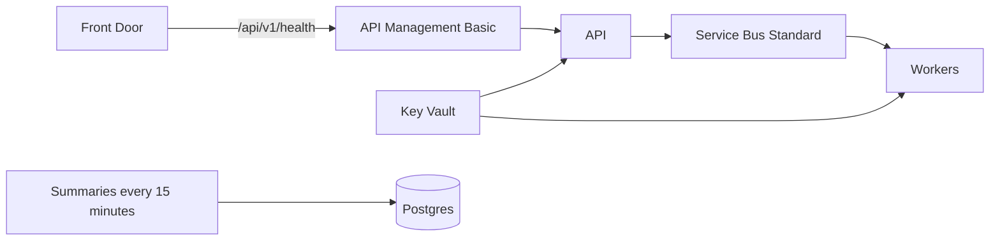

> Applicable only for cloud provisioning. This file is used only when deployed to the cloud with a multi-region deployment.

# Terraform

| | |
| --- | --- |
| Regions | `length(var.regions)`. Default eastus and westeurope |
| MCP | Not in this module. `MCP_AUDIO_URL` empty |
| Transcription | Bytes already loaded from Blob |

Check without Azure credentials:

```bash
terraform fmt -check -recursive
terraform init -backend=false
terraform validate
```

## Apply

```bash
cp terraform.tfvars.example terraform.tfvars
# set db_admin_password and jwt_secret
terraform init
terraform plan
```

| | |
| --- | --- |
| Required | `db_admin_password`, `jwt_secret` |
| `name_prefix` | Change before a real apply. Do not commit `terraform.tfvars` |
| Images | `api_image` and `worker_image`. One image |
| API | The image's default command |
| Worker | `python -m app.jobs.service_bus_worker` |
| Summary job | `python -m app.jobs.run_scheduled_rollup`, every 15 minutes |
| Secrets | Key Vault |



| Each region | |
| --- | --- |
| Network, Postgres 16, Blob `voice`, Redis Standard, Key Vault | Yes |
| Service Bus queues | `transcription` `llm-layer1` `llm-layer2` `rollup` |
| Models | `gpt-4o-transcribe` `gpt-5-mini` and Content Safety |
| Apps | API, workers, summary job, API Management |
| Add a region | One more object in `regions`, own address range |
| Shared database | No |

Picture: [docs/scaling.md](../../docs/scaling.md).
