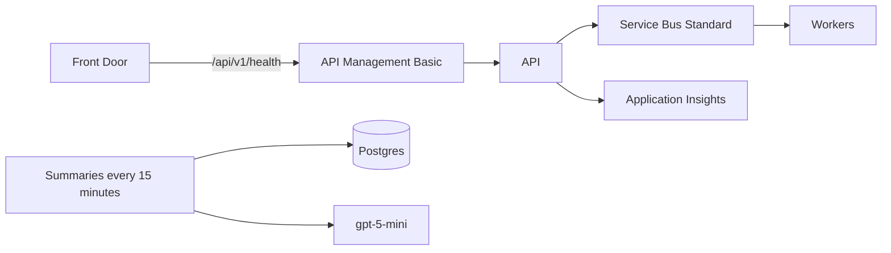

> Applicable only for cloud provisioning. This file is used only when deployed to the cloud with a multi-region deployment.

# Terraform

| | |
| --- | --- |
| Regions | `length(var.regions)`. Default eastus and westeurope |
| Azure OpenAI | `openai_location`. Default eastus2 and swedencentral, because eastus and westeurope do not offer `gpt-4o-transcribe` |
| MCP | Not in this module. `MCP_AUDIO_URL` empty |
| Transcription | Bytes already loaded from Blob |

Check without Azure credentials:

```bash
terraform fmt -check -recursive
terraform init -backend=false
terraform validate
```

## Apply

```bash
cp terraform.tfvars.example terraform.tfvars
# set db_admin_password and jwt_secret
terraform init
terraform plan
```

| | |
| --- | --- |
| Required | `db_admin_password`, `jwt_secret` |
| `name_prefix` | Change before a real apply. Do not commit `terraform.tfvars` |
| Images | `api_image` and `worker_image`. One image on ghcr.io, built and pushed by hand. CI has no deploy step |
| API | The image's default command |
| Worker | `python -m app.jobs.service_bus_worker`. 1 to 20 copies. A KEDA `azure-servicebus` rule adds one copy per waiting `transcription` message. It reads the queue with its own Manage rule (`scaler`); the apps keep the listen and send rule |
| Queues | 5-minute lock on each. The worker does not renew locks, so a job over 5 minutes is delivered again |
| Summary job | `python -m app.jobs.run_scheduled_rollup`, every 15 minutes. Gets the Azure OpenAI endpoint, key, and chat deployment, like the worker |
| Secrets | Container App secrets, set inline. Each region also gets a Key Vault, which nothing uses yet |
| Telemetry | API, workers, and job get `APPLICATIONINSIGHTS_CONNECTION_STRING`. Only the API starts the exporter, and its traces reach Application Insights. No `OTEL_*` variables are set: `OTEL_ENABLED=true` would start a tracer that keeps Azure Monitor from starting |
| Models | `gpt-4o-transcribe` on `GlobalStandard`, the only type Microsoft offers for it, so audio may be processed in any Azure region. `gpt-5-mini` on `DataZoneStandard`, inside the US or EU data zone. Microsoft lists `gpt-4o-transcribe` 2025-03-20 for retirement on 2026-10-15; check before an apply |
| Anonymous limit | API Management keys it on `X-Azure-ClientIP` from Front Door, or the caller IP when the header is missing |
| Langfuse | Not configured. No Langfuse keys are set |
| Front Door | Any healthy region. It does not route by `home_region`, so the other region answers 401 |
| Redis | Azure Cache for Redis Standard, the rate-limit counter. Known limit: it retires on 2028-09-30, and since 2026-04-01 a tenant that had no Azure Cache for Redis before that date cannot create one, so the apply fails there. Moving to Azure Managed Redis is a Terraform change |



| Each region | |
| --- | --- |
| Network, Postgres 16, Blob `voice` with versioning, Redis Standard, Application Insights, Key Vault (unused) | Yes |
| Blob lifecycle | Previous versions are deleted after 7 days, counted from when they were written |
| Service Bus queues | `transcription` `llm-layer1` `llm-layer2` `rollup`, 5-minute lock |
| Models | `gpt-4o-transcribe` `gpt-5-mini` and Content Safety |
| Apps | API, workers, summary job, API Management |
| Add a region | One more object in `regions`, own address range |
| Shared database | No |

Picture: [docs/scaling.md](../../docs/scaling.md).
